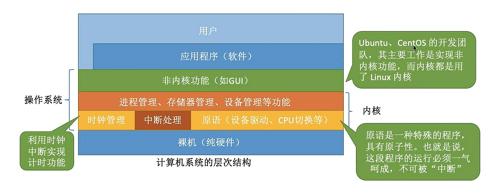
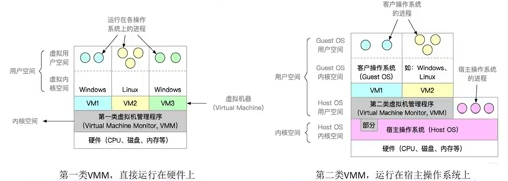

# 操作系統概念

上次編輯時間: 2025年9月9日 下午5:07
建立時間: 2025年8月5日 下午6:26

---

## ✏️操作系統的概念

**1️⃣ 概念（定義）**

- **管理與協調**：負責管理、協調硬體與軟體等計算機資源的工作
- **服務對象**：為上層用戶與應用程式提供簡單易用的服務
- **性質**：是一種**系統軟體**

---

**2️⃣ 功能和目標**

**🔑 資源的管理者**

- **處理機管理**
- **儲存器管理**
- **文件管理**
- **設備管理**

**🚀 向上層提供服務**

- **👤 給普通用戶**
    - GUI 使用者圖形介面
    - ⌨️ 命令接口
        - 聯機命令接口
        - 脫機命令接口
- **👨‍💻 給軟體 / 程序員**
    - 🛠️ 程序接口（即系統調用）

---

## ⚙️ 操作系統的特徵

1️⃣ 並發與共享

- **併發（Concurrency）：多個程序在同一時間段內交替執行，看起來像「同時」運行。**
- **並行（Parallelism）：多個程序在同一時刻真的同時執行。**
- **共享**
    - 互斥共享方式（例：對攝像頭設備的共享使用）
    - 同時共享方式（例：對硬盤資源的共享使用）

**2️⃣ 虛擬**

- 空分複用技術（例：虛擬化存儲技術）
- 時分複用技術（例：虛擬化處理器技術）

3️⃣ **異步（Asynchrony）:異步**指任務之間**不必等待彼此完成**就可以繼續執行

ex: I/O 異步處理：應用程式發送磁碟讀取請求後，不等磁碟返回數據，CPU 先去處理其他計算任務，數據準備好後再通知應用程式

---

## 📚操作系統的分類

1️⃣ 按 **使用者數量** 分

- **單使用者作業系統**
    - 同一時間只允許一位使用者操作
    - 例：早期 MS-DOS
- **多使用者作業系統**
    - 多位使用者可同時通過終端登入並使用
    - 例：Unix、Linux 伺服器版

---

2️⃣ 按 **任務數量** 分

- **單道批處理系統**
    - 一次只處理一道作業
    - 資源利用率低
- **多道批處理系統**
    - 多道作業同時駐留記憶體，交替執行
    - 提高 CPU 與資源利用率

---

3️⃣ 按 **交互方式** 分

- **批處理系統**
    - 使用者提交作業後，系統批量處理，不需交互
- **分時系統**
    - 多位使用者共享主機，按時間片輪流使用 CPU
- **即時系統**
    - 對外部事件快速響應，強調時間限制
    - 分為**硬即時**（必須在時限內完成）與**軟即時**（盡量在時限內完成）

---

4️⃣ 按 **用途** 分

- **通用作業系統**
    - 適用於多種應用場景
    - 例：Windows、Linux、macOS
- **嵌入式作業系統**
    - 用於特定設備或控制系統
    - 例：RTOS、VxWorks、嵌入式 Linux
- **網路作業系統**
    - 支援多機互聯與網路資源共享
    - 例：Novell NetWare、Windows Server

---

## 📳操作系統的運行機制

---

**兩類程序**

- **內核程序**（Kernel Program）
    - **內核（Kernel）**：操作系統最核心、最重要的部分，由多個內核程序組成
- **應用程序**（Application Program）

---

**兩種處理器狀態**

- **內核態**（Kernel Mode / 管態）
    - 執行 **特權指令**（只有內核程序可執行）
- **用戶態**（User Mode / 目態）
    - 執行 **非特權指令**（應用程序可執行）

---

**狀態切換**

1. **用戶態 → 內核態**：由 **中斷** 引起，硬體自動完成
2. **內核態 → 用戶態**：由一條修改 **PSW（程序狀態字）** 的特權指令完成

---

<aside>
💡

**內核作用與種類**

**大內核（Monolithic Kernel） V.S 微內核（Microkernel）** 

| 特性 | 大內核 | 微內核 |
| --- | --- | --- |
| 功能分佈 | 大部分功能在內核態 | 只保留基本功能在內核態 |
| 性能 | 高 | 相對低 |
| 穩定性 | 相對低 | 高 |
| 可擴展性 | 低 | 高 |
| 出錯影響範圍 | 大 | 小 |
| 代表系統 | Linux, Unix | MINIX, QNX, macOS（混合） |
</aside>

---

**🖥 操作系統結構**

1. **分層結構（Layered Structure）**

- 將操作系統劃分為多個層次，每層只與相鄰層交互。
- **特點**
    - 高層依賴低層提供的功能。
    - 各層之間接口明確，方便設計與調試。
- **優點**
    - 模塊化清晰，易於維護和測試。
    - 易於擴展或修改某一層功能。
- **缺點**
    - 層數過多可能降低性能（多層調用開銷大）。

---

2. **模塊化結構（Modular Structure）**

- 將操作系統功能劃分為相對獨立的模塊，每個模塊封裝一組相關功能。
- **特點**
    - 模塊之間通過明確接口溝通。
    - 可動態加載或卸載（尤其在現代內核中常用）。
- **優點**
    - 高靈活性，可根據需求組合功能。
    - 模塊出錯不一定影響整個系統。
- **缺點**
    - 模塊間接口設計複雜，需要明確定義。
- **例子**
    
    Linux 支持可加載內核模塊（Loadable Kernel Modules, LKM），如網卡驅動、文件系統模塊等。
    

---

3. **分層 vs 模塊化 對比表**

| 特性 | 分層結構 | 模塊化結構 |
| --- | --- | --- |
| 依賴關係 | 嚴格依賴相鄰層 | 模塊間可靈活互動 |
| 擴展性 | 中等 | 高 |
| 性能 | 可能有多層調用開銷 | 接口優化後性能較好 |
| 易維護性 | 高 | 高 |
| 實例 | THE OS（早期分層系統） | Linux LKM |

---

## ⏹️中斷

**1. 廣義的中斷**

- **定義**：與當前執行的指令有關或無關，中斷信號可能來自 CPU 內部或外部。

---

**2. 內中斷（又稱 異常、例外）**

- **定義**：與當前執行的指令有關，中斷信號來自 **CPU內部**。

**類型**

1. **陷阱 / 陷入（trap）**
    - 由陷入指令引發
    - 應用程序**故意**觸發
2. **故障（fault）**
    - 由錯誤條件引起，可被內核程序修復
    - 修復後，CPU 使用權歸還給應用程序繼續執行
    - **例**：缺頁故障
3. **終止（abort）**
    - 由**致命錯誤**引起，內核無法修復
    - 不再將 CPU 使用權還給應用程序，而是**直接終止**該程序
    - **例**：整數除以 0、非法使用特權指令

---

**3. 外中斷（又稱 中斷）**

- **定義**：與當前執行的指令**無關**，中斷信號來自 **CPU外部**。

**類型**

1. **時鐘中斷**
2. **I/O 中斷請求**

---

**4. 狹義的中斷**

- 專指 **外中斷**
- 大部分教材與試卷中，「中斷」特指外中斷，而內中斷一般稱為「異常」。

---

## 📌 系統調用（System Call）簡介

- 操作系統對應用程序/程序員提供的**接口**。

---

系統調用 vs 庫函數

- **有的庫函數**：是對系統調用的進一步封裝。
- **有的庫函數**：不使用系統調用，直接在用戶態執行。

---

**為什麼系統調用是必須的？**

- 舉例：Word 和 WPS 同時打印
- 凡是**與共享資源有關**、可能影響其他進程的操作，都必須由操作系統介入 → 需要通過系統調用實現。

---

**功能**

- 設備管理
- 文件管理
- 進程控制
- 進程通信
- 內存管理

---

**系統調用的過程**

1. 傳參
2. **陷入指令（Trap）/ 訪管**
3. 由操作系統內核程序處理系統調用請求
4. 返回應用程序

---

## 💻 電腦開機（開機引導）流程

**CPU → BIOS(ROM) → 讀取MBR → 讀取PBR → 找到Boot Manager → 載入作業系統核心 → 完成啟動**

1. **啟動 BIOS（ROM 引導程序）**
    - **CPU** 從固定的主存地址開始取指令
    - 執行 **ROM（BIOS）** 中的引導程序
    - 完成**硬體自檢（POST）**
    - 硬體檢查通過後，準備啟動
2. **讀取主引導記錄（MBR）**
    - 從磁碟第一塊（扇區 0）讀入 **MBR** 到 RAM
    - MBR 包含：
        - 磁碟引導程式
        - 分區表（Partition Table）
3. **加載分區引導記錄（PBR）**
    - 從活動分區（通常是系統安裝所在的主分區，如 C:）讀取 **PBR**
    - PBR 負責找到並啟動 **操作系統引導管理程式**（如 Windows Boot Manager）
4. **加載作業系統核心與初始化程序**
    - 從根目錄尋找並載入完整的操作系統核心檔案
    - 執行 OS 初始化（啟動管理器 → 核心加載 → 驅動載入 → 登入界面）

---

## 🖥 虛擬機（VMM） & 容器( Container)

| 特性 | 第一類 VMM（Type 1, Bare-metal） | 第二類 VMM（Type 2, Hosted） |
| --- | --- | --- |
| **對物理資源控制權** | 直接運行在硬體上，可直接控制和分配物理資源 | 運行在 Host OS 上，依賴 Host OS 分配資源 |
| **資源分配方式** | 安裝 Guest OS 時，直接分配物理硬體（外核模式） | Guest OS 使用虛擬磁碟（實際是 Host OS 檔案系統中的檔案），內存為虛擬內存 |
| **性能** | 高，少了 Host OS 中介層 | 較低，需要經過 Host OS |
| **可支持的虛擬機數量** | 多，因為不與 Host OS 競爭資源 | 較少，Host OS 本身需要使用資源 |
| **可遷移性** | 較差，依賴硬體配置 | 較好，只需導出映像文件即可遷移 |
| **運行模式** | 最高特權級（Ring 0） | 部分在用戶態、部分在內核態，Guest OS 系統調用會被 Host OS 攔截 |

**虛擬機管理程序→ Virtual Machine  Monitor/Hypervisor**

**例子：**

- Type 1：VMware ESXi、Microsoft Hyper-V（裸機版）、Xen
- Type 2：VMware Workstation、Oracle VirtualBox、Parallels Desktop

---

**📦 容器（Container）**

- **定義**
    
    一種作業系統層虛擬化技術，透過共享 Host OS 核心，將應用程序及其依賴打包成獨立運行的環境。
    
- **特點**
    - 啟動速度快（秒級）
    - 資源開銷小（共用內核，不需模擬整個硬體）
    - 跨平台遷移方便（只要 Host 支援容器引擎）
    - 隔離性略弱於虛擬機（共用內核）
- **技術基礎**
    - Linux Namespace（隔離）
    - Linux Cgroups（資源限制）
- **常見容器引擎**
    - Docker
    - containerd
    - Podman
- **適用場景**
    - 微服務架構
    - DevOps CI/CD
    - 測試與開發環境快速部署

---

🔍 虛擬機 vs 容器 對比表

| 特性 | 虛擬機 | 容器 |
| --- | --- | --- |
| 啟動速度 | 慢（分鐘） | 快（秒級） |
| 資源開銷 | 高（需要完整 OS） | 低（共用 Host OS 核心） |
| 隔離性 | 強（完整 OS 隔離） | 較弱（共用內核） |
| 移植性 | 映像檔可遷移 | 容器映像可直接部署 |
| 適用場景 | 運行多種 OS、高隔離需求 | 微服務、快速部署、彈性伸縮 |

---