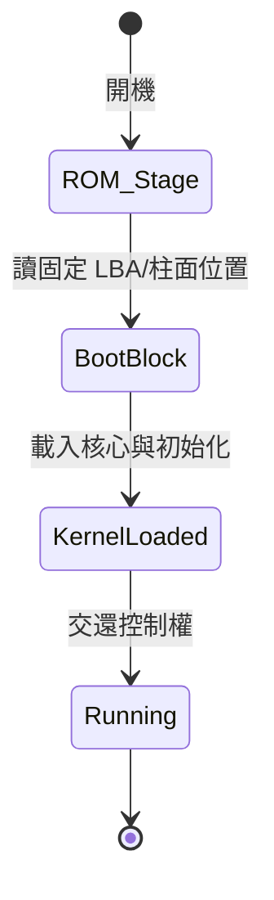

# 設備管理

上次編輯時間: 2025年9月18日 下午1:24
建立時間: 2025年9月17日 下午5:00

## I/O基本概念

---

## 1) 什么是 I/O 设备

- **I/O = Input/Output**：向计算机**输入**数据 or **接收**计算机**输出**的数据的外设。
- **UNIX 抽象**：把设备当“**特殊文件**”，对设备操作 ≈ `read`/`write` 文件：
    - `read`：从设备**输入**到内存
    - `write`：把内存数据**输出**到设备

---

## 2) 按使用特性分（理解为主）

- **人机交互类**：键盘、鼠标、打印机（**慢**，字节/少量字节为单位）
- **存储类**：磁盘/移动硬盘/SSD（**快**）
- **网络通信类**：网卡、调制解调器、路由/交换端口（**中等**）

> 速度界限不严格，考试几乎不问细数值。
> 

---

## 3) 按传输速率分（了解即可）

- **低速**：键盘/鼠标（每秒几~几百 B）
- **中速**：如激光打印机
- **高速**：磁盘/SSD（千字节/秒以上，实际更高）

---

## 4) 按信息交换单位分（**考试重点**）

| 类别 | 传输基本单位 | 典型设备 | 关键特性 | 常见控制方式 |
| --- | --- | --- | --- | --- |
| **块设备 (Block)** | **块/扇区/页** | 磁盘、SSD、U 盘 | **可寻址、随机访问**，吞吐高，常配**缓冲/缓存** | 可配合 **DMA**、调度 |
| **字符设备 (Character)** | **字符/字节/流** | 键盘、鼠标、串口 | **不可寻址**，顺序/流式，速度低 | 常用**中断驱动** |

> 记忆：块=可寻址&随机访问；字符=流式&不可寻址。
> 
> 
> 在 UNIX/Linux：块设备通常支持 `lseek`；字符设备多为流式接口。
> 

---

## 5) 易混&易考点

- **抽象为文件**不代表“文件数据”就进内存：只有 `read/write` 才搬数据；`open` 只是建立状态。
- **块 vs 字符**考点词：
    - “可寻址/随机访问/缓冲/高吞吐” → **块设备**
    - “流式/中断驱动/不可寻址/慢速” → **字符设备**
- “高速/中速/低速”无硬边界，**不必死记数值**。

---

## 6) 和后续章节的衔接（提前心里有数）

- 三种 I/O 控制方式会紧跟着学：**程序查询（轮询） → 中断驱动 → DMA**（性能逐级更好）。
- 设备在 OS 里通常还涉及：**设备控制器/驱动、缓冲、队列、调度（尤其磁盘调度）**。

---

## 7) 3 题自测

1. 磁盘属于哪一类？是否可寻址？——**块设备，可寻址/随机访问**。
2. 键盘是如何触发 CPU 处理输入的？——**字符设备，常用中断驱动**。
3. 为什么 UNIX 把设备当文件？——**统一接口，使用 `read/write` 即可操作设备**。

## I/O控制器

---

## 1) 它是什么 & 为什么需要

- **I/O 控制器**（设备控制器）= 电子部件，位于 **CPU ↔ 设备机械部件** 之间的“中介/翻译器”。
- CPU **不能**直接操控机械部件，必须**通过控制器**发命令、拿数据、查状态。

---

## 2) 四大功能 ≈ 三类寄存器 + 地址识别

1. **接收/识别命令与参数** → **控制寄存器**（写入“读/写、字节数等”控制字）
2. **上报设备状态** → **状态寄存器**（忙/闲/故障…；CPU 读它）
3. **数据交换** → **数据寄存器**（输出：CPU→数据寄存器→设备；输入反之）
4. **地址识别**（哪块寄存器？哪个设备口？）
    - 需要对**寄存器**和**设备接口**进行编址/选择

> 一般都不只 1 个寄存器；一个控制器也常挂多个设备，所以更要编址。
> 

---

## 3) 典型结构（3 大块）

- **CPU↔控制器接口**：地址线（选谁）、数据线（搬啥）、控制线（干啥）
- **I/O 逻辑**：译码地址、解释命令、组织数据流、更新状态
- **控制器↔设备接口**：数据通路、状态反馈线、设备控制线

---

## 4) 两种“寄存器编址”方式（高频选择题）

| 方式 | 概念 | 优点 | 缺点 | 常见指令 |
| --- | --- | --- | --- | --- |
| **内存映射 I/O (MMIO)** | 寄存器占用**内存地址空间** | 直接用**普通访存**指令；编程统一 | 占用地址空间；可能与缓存/一致性交互更复杂 | `load/store` |
| **独立 I/O（端口 I/O）** | 寄存器有**独立端口地址** | 不占内存地址空间 | 需**专门 I/O 指令**；接口不统一 | `in/out` 等 |

---

## 5) 一次操作的“流水”图（牢记思路）

- **输出（写设备）**：
    
    CPU 写控制字→控制寄存器；数据→数据寄存器 → 控制器经设备接口送到设备 → 状态寄存器置位完成/忙
    
- **输入（读设备）**：
    
    设备经接口把数据送入控制器 → 放入数据寄存器 → 状态寄存器置“就绪” → CPU 读数据寄存器
    

> 后续小节会在此基础上展开三种控制方式：程序查询 / 中断驱动 / DMA。
> 

---

## 6) 易错点/命题点

- “**控制/状态/数据寄存器**对应啥？”——控制寄存器**收命令**，状态寄存器**报状态**，数据寄存器**放数据**。
- “**一个控制器能否连多个设备**？”——能；因此需要**设备选择/接口编址**。
- “**MMIO vs 独立 I/O**”优缺点要会背（是否占用内存地址、是否用普通访存指令）。
- CPU 与控制器交互用**地址线/数据线/控制线**三类信号，别混淆。

---

## 7) 3 题自测

1. 为什么需要状态寄存器？**答**：让 CPU 轮询/中断时知道设备**忙/就绪/故障**等状态。
2. MMIO 有啥直接好处？**答**：可用普通 **load/store** 访问寄存器，接口统一、编程简化。
3. 控制器多设备时如何区分？**答**：给**设备接口编址/编号**，CPU 在控制字/地址线上指明目标。

## I/O控制方式

---

# 程序直接控制（Programmed I/O，**轮询**）

- **流程**：CPU下达读/写→设备忙→CPU**不断轮询**状态寄存器→就绪后从**数据寄存器**取“1个字”进CPU寄存器→再写入内存（写出相反）。
- **CPU干预**：**极高**（全过程忙等）。
- **传输单位**：**字**。
- **数据流向（读）**：设备 → 控制器数据寄存器 → **CPU寄存器** → 内存。
- **优/缺**：实现简单；但CPU/设备**不能并行**、利用率低。

---

# 中断驱动（Interrupt-driven I/O）

- **流程**：CPU发I/O命令→去做别的事→设备就绪触发**中断**→CPU进中断服务：取**1个字**到CPU寄存器→写内存。
- **CPU干预**：**较低**（开始+每次就绪中断）。
- **传输单位**：**字**。
- **数据流向（读）**：同上，仍需**经过CPU**。
- **优/缺**：CPU与设备可并行；但**字粒度**→**中断频繁**、有保存/恢复现场开销。

---

# DMA（Direct Memory Access，**直接存储器存取**）

- **要点寄存器**：
    
    **DR** 数据寄存器（字粒度中转）｜**MAR** 内存地址寄存器（放到/取自内存哪）｜**DC** 计数器（还剩多少字节）｜**CR** 命令/状态。
    
- **流程**：CPU一次性告知：方向、外设地址、**内存起址(MAR)**、**传输字节数(DC)** → 交给DMA控制器 → **整块**搬运完成后**一次中断**通知CPU。
- **CPU干预**：**更低**（块开始/结束）。
- **传输单位**：**块**（或若干**连续块**）。
- **数据流向（读）**：设备 ↔ 控制器**DR** ↔ **内存**（**绕过CPU**）。
- **优/缺**：效率高、并行性好；但**仅便捷处理连续块**，离散块需多次命令。

---

# 通道（Channel，**弱鸡版CPU + 通道程序**）

- **概念**：专用硬件能执行**通道指令**；从内存取“**通道程序**”（任务清单）自行驱动多个控制器/设备。
- **流程**：CPU只指定“用哪个通道+通道程序地址”→通道按程序批量完成一组I/O → **完成后一次中断**。
- **CPU干预**：**极低**。
- **传输单位**：**一组块**（批处理）。
- **数据流向**：设备 ↔ 内存（由通道/控制器直接搬运）。
- **优/缺**：CPU/通道/设备**高度并行**；实现**复杂**，需专用硬件。

---

## 一屏对比（背这个就够）

| 方式 | CPU干预 | 传输单位 | 数据是否绕过CPU | 并行性 | 主要短板 |
| --- | --- | --- | --- | --- | --- |
| 程序直接控制 | 极高（轮询） | 字 | 否 | 无 | 忙等、利用率低 |
| 中断驱动 | 较低（每字中断） | 字 | 否 | 有 | 中断过多、开销 |
| DMA | 低（块首尾） | 块/连续多块 | **是** | 更好 | 离散块需多次设置 |
| 通道 | 极低（批量完成一次中断） | 组块 | **是** | 最高 | 硬件/实现复杂 |

---

## 易考细节/陷阱

- **程序直接控制/中断驱动**：**每次1个字**，**必须经过CPU寄存器**再入内存。
- **DMA**：CPU预置 **MAR/DC/CR**；数据仍以**字**在控制器内部周转，但对外呈现**块**传输；“多块”默认指**连续**多块。
- **通道**：把“多次DMA/离散块/多设备序列”写成**通道程序**一次交付；一个**通道可控多个控制器**，控制器又可连多设备。
- CPU**在每条指令末尾**统一**查询中断**（中断驱动/完成中断都依赖此机制）。

---

## 3 题快测

1. 哪两种方式**数据必须经过CPU**？→ 程序直接控制 & 中断驱动。
2. DMA“一次多块”有什么**隐含前提**？→ **块在外设与内存均应连续**；离散块要多次DMA设置。
3. 通道与DMA的**本质差别**？→ DMA是**一次性搬一块/连续块**；通道能**按通道程序批量/多步骤/跨设备**地组织成**一组块**传输，CPU更少干预。

## I/O層次結構

---

# 层次一览（上→下）

1. **用户层软件**
    - 位置：用户态
    - 职责：提供**库函数**（如 `printf/scanf`），把调用**封装成系统调用**（如 `write/read`）并传参。
    - 关键词：易用封装、调用接口。
2. **设备独立性软件**（= 系统调用处理层 / 设备无关层）
    - 位置：内核
    - 职责（背口诀“**接护错分缓映选**”）：
        - **接**口：向上提供统一的 `open/read/write/...` 接口；屏蔽具体设备差异。
        - **护**：设备访问**保护/权限**（设备视作特殊文件）。
        - **错**：基本**差错处理**（类型繁多，理解即可）。
        - **分**：**设备分配与回收**（设备多为临界资源）。
        - **缓**：**缓冲区管理**（弥合速度/数据单位差异）。
        - **映**：**逻辑设备名 → 物理设备名** 映射（**LUT**），记录**驱动入口地址**。
        - **选**：按设备类型**选择驱动程序**。
    - LUT 管理两种：
        - **系统一张**：适合单用户；逻辑名不得冲突。
        - **每用户一张**：适合多用户；逻辑名可重名（类比**两级目录**）。
3. **设备驱动程序**
    - 位置：内核（常以内核线程/进程形态存在）
    - 职责：**直面硬件细节**：设置/读写**控制器寄存器**、检测状态、启动设备、与中断/ DMA 协作。
    - 特点：**厂商提供**，不同设备实现细节不同（寄存器数、状态位语义等）。
4. **中断处理程序**
    - 位置：内核
    - 职责：处理**I/O 完成中断**：
        1. 读**状态**（判正常/异常）；
        2. 正常则从**数据寄存器取 1 个字**，放入**内存缓冲区**；
        3. 唤醒阻塞进程/继续下一步 I/O；异常则按原因处理。
    - 注：与驱动一道是**唯二直接触硬件**的软层。
5. **I/O 硬件**（机械 + 控制器电子部件）
    - 本节了解即可（细节在“控制器”小节）。

---

# 两条“时序线”必须会

## （A）请求自上而下

用户层库函数 → **系统调用** → 设备独立层：权限/分配/缓冲/查 **LUT** & 选驱动 → **驱动**：设寄存器、启动设备/发 DMA → **硬件执行**。

## （B）完成自下而上

**硬件发中断** → **中断处理**：判状态、取**1字**入内存缓冲 → 交给**驱动**做后续 → 回到**设备独立层**做账/唤醒 → 返回**用户层**。

---

# 高频考点与易混点

- **谁直接碰硬件？只有驱动**和**中断处理**；其余在“设备独立层”。
- **权限/保护/分配/缓冲/LUT**都在**设备独立层**。
- **LUT**：不仅映射**逻辑名→物理名**，还保存**驱动入口地址**。
- **设备=特殊文件**：因而可复用文件保护/接口（`open/read/write`）。
- *中断处理取“1 字”**入内存缓冲，这是经典细节点。
- “系统调用处理层”=**设备独立性软件**（别被名称换皮迷惑）。
- LUT“**系统一张 vs 每用户一张**”= 单级目录 vs 两级目录的类比题。

---

# 小测 6 题（自检 30 秒）

1. `printf("hi")` 最终在内核哪层落地为 `write`？→ **设备独立性软件**（系统调用处理层）。
2. 选择驱动、查 LUT、做权限检查归谁？→ **设备独立性软件**。
3. 谁设置控制寄存器启动设备？→ **设备驱动程序**。
4. I/O 完成后第一步谁先上场？做啥？→ **中断处理程序**；读状态，**取 1 字**入内存缓冲。
5. 哪两层直接与硬件打交道？→ **驱动 + 中断处理**。
6. 多用户系统允许相同逻辑名且映射不同物理设备，LUT 应如何放？→ **每用户一张 LUT**。

---

## I/O 应用程序接口 & 设备驱动程序接口

---

# 一、为何需要多种 I/O 接口？

设备差异巨大：

- **字符设备**：不可寻址，单位是“字符/字节”（如键盘、串口）。
- **块设备**：可寻址，单位是“块/字节”（如磁盘）。
- **网络设备**：按“报文/流”收发，需要区分进程（IP+端口）。

因此**设备独立性软件**必须对上层提供**不同的系统调用族**。

---

# 二、三类应用程序接口（系统调用视角）

## 1) 字符设备接口

- **典型调用**：`get()` / `put()`（一次一个字符/字节）。
- **特征**：**无寻址**，不能 `seek`。

## 2) 块设备接口

- **典型调用**：`read(fd, buf, n)` / `write(fd, buf, n)`
    
    配合 `seek/lseek(fd, off, whence)` 设置读写位置。
    
- **特征**：**可随机寻址**；一次可读写多个字节/块。

## 3) 网络设备接口（套接字 Socket）

- **创建**：`socket(domain, type, protocol)`（如 TCP/UDP）。
- **绑定本地端口**：`bind(fd, local_ip:port)`
- **主动连接**：`connect(fd, remote_ip:port)`
    
    > （服务端还会有 listen/accept，这里理解为建立点对点“应用层连接”即可）
    > 
- **收发**：`read/write` 或 `recv/send`。
- **数据路径（发送）**：用户缓冲区 → **内核套接字缓冲区** → **驱动** → **网卡** → 网络。
    
    **（接收）**：网卡中断 → 驱动 → **内核缓冲区（按端口分流）** → 用户 `read` 取走。
    
- **为何能同时“收发给不同进程”？**
    
    依**IP+端口**完成分流；每个套接字**绑定端口**，对应独立的内核缓冲区。
    

---

# 三、阻塞 I/O vs 非阻塞 I/O（易考概念）

- **阻塞 I/O**：发起系统调用后**进程阻塞**，直到 I/O 完成
    
    例：键盘输入 `getchar/scanf`——没按键就一直等。
    
- **非阻塞 I/O**：系统调用**迅速返回**，进程无需等待
    
    直观理解：比如 `write` 到磁盘/网络时，**内核先把数据拷入内核缓冲区就返回**；后续由内核/驱动慢慢写到设备。
    
    > （进阶：实际系统常通过设置非阻塞标志、配合就绪通知/复用机制，但考试掌握“是否阻塞等待”与“内核缓冲”这层含义即可。）
    > 

---

# 四、设备驱动程序接口（厂商写、OS定标准）

- **问题**：不同厂商硬件细节不同（寄存器数目/状态位语义各异），若接口不统一，**设备独立层**就得改内核代码去适配，极不现实。
- **做法**：操作系统规定**统一的驱动接口形状**（函数名、参数个数/类型、返回值语义等）。
    - 例如统一要求实现：`init/open/read/write/ioctl/close/…`（名称/参数**固定**）。
    - **设备独立层**通过**LUT**找到**物理设备**与**驱动入口地址**，再按**统一接口**调用。
- **你要记住**：
    - **驱动 & 中断处理**直接碰硬件；
    - **设备独立层**做权限、分配、缓冲、**逻辑名→物理名映射（LUT）**、选择驱动。

---

# 五、表格速背（设备对比）

| 设备类型 | 是否可寻址 | 传输基本单位 | 典型接口 | 是否可 `seek` |
| --- | --- | --- | --- | --- |
| 字符设备 | 否 | 字符/字节 | `get/put` | 否 |
| 块设备 | 是 | 块/字节 | `read/write` + `seek` | 是 |
| 网络设备 | N/A（按报文/流） | 报文/字节流 | `socket/bind/connect` + `read/write` | 否（按连接/报文语义） |

---

# 六、易错点提醒

- **字符设备不可寻址**：不会有 `seek` 参数。
- **块设备要配合 `seek`**：位置 + `read/write` 才完整。
- **网络数据为何不丢给错的进程？**——**端口分流**（IP+端口 → 套接字缓冲）。
- **非阻塞 I/O**不等于“已写到设备”，常是“**已进内核缓冲**”。
- **驱动接口统一**是为了让**设备独立层**不用改内核即可调用不同厂商设备。

---

# 七、3 题自测

1. 下面哪个必须提供地址参数：`get`、`put`、`read`(磁盘)、`read`(键盘)？
2. `write` 网络套接字为何能快速返回？
3. “谁”决定把网卡收来的包放进哪个进程的套接字缓冲区？

> 参考：1) 磁盘 read；2) 先拷入内核套接字缓冲区后异步发送；3) 协议栈按IP+端口匹配到对应套接字。
> 

## SPOOling技術

---

# 1) 脱机 I/O（Off-line I/O）是啥？

- **背景**：纸带机/打印机极慢 → CPU常年“干等”。
- **做法**：用**磁带**作“中间站”。
    
    **预输入**：先把外设数据→磁带；CPU再从磁带快读。
    
    **缓输出**：CPU先把结果→磁带；再由磁带→慢外设。
    
- **核心收益**：**解耦速度**（慢外设 vs 快CPU）、CPU与外设**并行**、减少盲等。
- *“脱机”**的含义：**脱离主机直接控制**完成 I/O（由外围控制机/磁带机处理）。

---

# 2) 假脱机（SPOOL）= 用软件把“脱机”搬进现代 OS

> 概念：用磁盘充当“大缓冲池”，配合并发的输入/输出进程，把独占设备“伪装成”可共享设备。
> 

## 组成（名词对照）

- **磁盘输入井 / 输出井**：模拟两盘磁带，**持久大缓冲**。
- **内存输入/输出缓冲区**：短期**中转**。
- **输入进程 / 输出进程**：分别**收容输入**、**驱动输出**（需**多道程序并发**支持）。
- **SPOOL 管理进程**：分配回收井中缓冲、维护队列/任务表。
- **打印请求表**（作业说明书/元数据）：记录**数据所在缓冲、页数、份数、优先级…**
- **脱机文件队列**：**按策略排队**的打印/输出任务队列。

> 层次位置：实现常在用户层（但考纲把它也归为 I/O 系统考点）；运行要依赖设备独立性软件 + 驱动 + 中断配合。
> 

---

# 3) 工作流程（两条线）

## A. 预输入（模拟脱机输入）

设备 → **内存输入缓冲** → **磁盘输入井**

（由**输入进程**搬运；上层稍后再从井里按需读取）

## B. 缓输出（模拟脱机输出）

用户进程提交输出 → **SPOOL 管理**给**输出井缓冲** & 建**请求表**入队

→ **输出进程**按队列取任务：**输出井** → **内存输出缓冲** → **设备**

→ 完成后回收缓冲/表项

---

# 4) 共享打印机：一眼看懂

1. 进程调用“打印” → **SPOOL 管理进程**：
    - 在**输出井**分配一块大缓冲，**落盘**数据；
    - 生成**打印请求表**（数据位置、份数、用户、优先级…），挂到**脱机文件队列**。
2. **输出进程**循环：取队头任务 → 读**输出井**块 → 入**内存输出缓冲** → 喂**打印机**。
3. 打完：**回收**井中缓冲与请求表；取下一个任务。

> 效果：单台独占打印机被虚拟成多台逻辑打印机；用户进程立即返回，不必等打印完成（非阻塞体验）。
> 

---

# 5) 易混 & 必背

- **SPOOL vs 缓冲/Cache**：
    - SPOOL = **用磁盘的大缓冲 + 队列 + 管理进程** 的**系统级机制**；
    - 缓冲/Cache = **内存**层面的临时存取优化。
- **SPOOL vs DMA/中断**：
    - SPOOL 解决**作业级调度&共享**；
    - DMA/中断解决**数据移动效率/CPU解放**。二者**可同时存在**，互补。
- **前提**：需要**磁盘**作大缓冲、**并发**（多道程序）。
- **本质收益**：**速度解耦 + 独占→共享 + 非阻塞提交**；**不等于**提高打印机物理速度。
- **层次定位**：常在**用户层**实现；考试可能把它与**设备独立性软件**的调度/保护题同框。

---

# 6) 微题快练

1. SPOOL 的“输出井”“打印请求表”“输出进程”分别对应什么角色？
    - 井=磁带；请求表=任务说明；输出进程=“虚拟控制器/操作员”。
2. 多用户同时打印为何互不串页？
    - **先落井→排队→逐作业喂设备**，物理设备始终**一次只为一个任务**服务。
3. SPOOL 必须依赖哪两点？
    - **磁盘**（大缓冲）与**多道并发**（输入/输出进程并行）。

---

# 7) 一句话记忆

> “磁盘当大缓冲，进程当虚拟控制器；队列排任务，独占变共享。”
> 

## 設備分配與回收

# 设备独立性软件：设备的分配与回收

## 一、分配要点（三个角度）

- **设备固有属性**
    - **独占设备**：同一时段只能服务一个进程（如打印机）。
    - **共享设备**：宏观可并发，微观交替使用（如磁盘）。
    - **虚拟设备**：用 **SPOOL** 把独占设备“虚拟成”可共享。
- **分配算法**：FCFS、优先级、高响应比、短作业优先等（按题给算法套）。
- **安全性策略**
    - **安全分配**：进程获得设备后 **阻塞等待 I/O 完成**；同一时段只持有一个设备 → 破坏“请求与保持”，**不死锁**，但 CPU/设备 **串行**、利用率低。
    - **不安全分配**：获得设备后 **不阻塞**，可继续请求别的设备 → **高并行/高效率**，但 **可能死锁**（需银行家算法/检测与解除配套）。

## 二、静态 vs 动态分配

- **静态分配**：进程开始前一次性拿齐所需资源；运行完再归还。**破坏请求与保持 → 不死锁**，但可能 **启动等待长/利用率低**。
- **动态分配**：运行中按需申请/释放。**灵活高效**，但可能 **死锁**（配合避免/检测策略）。

## 三、分配用到的数据结构（树形从属：通道 ➜ 控制器 ➜ 设备）

- **DCT（Device Control Table，设备控制表）**
    
    常见字段：设备类型、**设备标识符(物理名)**、设备状态（忙/闲/故障）、→ **控制器表指针**、**重试计数**、**设备等待队列头指针**。
    
- **COCT（Controller Control Table，控制器控制表）**
    
    字段：控制器ID、状态、→ **通道表指针**、**等待队列（头/尾）**。
    
- **CHCT（Channel Control Table，通道控制表）**
    
    字段：通道ID、状态、→ **所连控制器集合指针**、**等待队列（头/尾）**。
    
    
    
- **SDT（System Device Table，系统设备表）**
    
    **记录全系统设备**：设备类型、设备ID、→ **DCT 指针**、**驱动程序入口地址**。
    
- **LUT（Logical Unit Table，逻辑设备表）**
    
    **逻辑名 ↔ 物理名** 映射 + 驱动入口。
    
    - 单表（全系统 1 张）：**逻辑名不可重名**（单用户适用）。
    - 每用户一张：**逻辑名可重名**（多用户适用）。

> 小图示：CHCT → COCT(们) → DCT(们)（一通道多控制器，一控制器多设备）
> 

## 四、用“物理设备名”的分配步骤（基础版）

1. 进程提供 **物理设备名** → 查 **SDT** 找到该设备 → 得到 **DCT**。
2. 看 DCT 状态：闲则分配；忙则把进程 **挂到 DCT 等待队列**。
3. 沿 DCT 的指针找 **COCT**：闲则分配；忙则挂 **控制器等待队列**。
4. 再找 **CHCT**：闲则分配；忙则挂 **通道等待队列**。
5. **设备+控制器+通道** 三者都成功分配后，启动 I/O。

**缺点**

- 程序和“物理名”**强耦合**（设备更换则程序失效）。
- **利用率低**：请求 A 打印机忙就必须等，即便同类 B/C 空闲。

## 五、改进：用“逻辑设备名”的分配（推荐版）

- 进程只给 **逻辑设备名（设备类型）**。OS 在 **SDT** 中挑选 **同类型的空闲物理设备** 分配（提高利用率）。
- 在 **LUT** 新增映射项：**逻辑名→物理名** + **驱动入口**。
- 之后同一逻辑名的请求先查 **LUT**，直达其物理设备 & 驱动。
- 后续控制器/通道分配与上同。

## 六、回收（一句话）

- I/O 完成后：**释放 DCT/COCT/CHCT 占用标志**，从相应等待队列 **唤醒下一进程**（按调度策略），必要时清零重试计数、回收 LUT/映射（若进程结束）。

## 七、易考/易错点

- **安全分配 vs 静态分配**：前者是 **运行期策略**（一次只持有一个设备且等待完成）；后者是 **运行前拿齐全部资源**。二者都可 **避免死锁**，但含义不同。
- **树形从属** 必背：通道＞控制器＞设备（别写反）。
- **物理名方案的两大劣势**：耦合强、同类设备空闲也等。
- **LUT 作用**：解耦 + 负载均衡同类设备。单表/每用户一表要会区分。
- **等待队列位置**：DCT/COCT/CHCT **都有**等待队列（按谁忙就挂哪儿）。

## 八、极简记忆串

> “先 SDT 找 DCT；再上 COCT、CHCT；三者皆成再启动。物理名耦合深，逻辑名解耦+均衡；LUT 做映射，驱动看入口。”
> 

## 緩沖區管理

# 缓冲区管理

## 1. 缓冲区是什么 & 有啥用

- 本质：一块**临时存储区**（硬件寄存器/内存）。考试默认“内存缓冲区”。
- 作用：
    - **平滑速率不匹配**：CPU 快、设备慢 → 互不等待。
    - **降低中断频率**：按“块满/空”再中断，而非“每字节/字符”。
    - **桥接粒度不匹配**：进程一次一块，设备一次一字节/字符。
    - **提高并行性**：CPU 计算与 I/O 读写可部分重叠。

> 规则（常考）
> 
> - 缓冲区**空**：可“充入”数据；**满**：可“取出”数据。
> - **充满后**才可被取；**取空后**才可再充。

---

## 2. 单缓冲（Single Buffer）

设

- **T**：设备把“1 块”装满缓冲区的时间
- **M**：缓冲区 ↔ 工作区（用户区）搬运时间
- **C**：CPU 处理“1 块”数据的时间

**平均每块耗时**：

单缓冲=  $\boxed{ \; \text{单缓冲} = \max(T,\, C) + M \; }$

- 推导要点：两种情形
    - T＞C：等设备充满 → **T+M**
    - T＜C：等计算结束再搬运 → **C+M**

**小例**：T=8，C=3，M=1 ⇒ 9；T=3，C=8，M=1 ⇒ 9

---

## 3. 双缓冲（Double Buffer）

两块等大小缓冲区，允许**充/取并行交替**。

**平均每块耗时**：

双缓冲=  $\boxed{ \; \text{双缓冲} = \max(T,\, C+M) \; }$

- 情形
    - T ≥ C+M：受制于填充 → **T**
    - T ＜ C+M：受制于“处理+搬运” → **C+M**

**小例**：T=8，C=3，M=1 ⇒ max(8,4)=8；T=3，C=8，M=1 ⇒ max(3,9)=9

> 对比：双缓冲 ≤ 单缓冲（因为把“等待”更多重叠了）
> 

---

## 4. 单/双机通信的缓冲

- **单缓冲**：同一时刻**单向**传输（对端缓冲区需取空后才能反向发送）。

- **双缓冲**：一发一收两块 → **双向同时**传输（全双工）。
    
    
    

---

## 5. 循环缓冲区（Ring Buffer）

- 多个等大缓冲块首尾相连，两个指针：
    - **in**：指向下一个可充入的**空块**；
    - **out**：指向下一个可取出的**满块**。
- 判满/判空常见做法：**预留一块**或维护**计数器**（避免 in==out 二义性）。
- 作用：当双缓冲仍不够时进一步解耦生产/消费速率。

---

## 6. 缓冲池（Buffer Pool）

- 三个队列：**空缓冲队列、输入队列、输出队列**。
- 四类“工作缓冲区”角色（名字拗口，记功能即可）：
    1. 收容输入（从设备→缓冲：空队列取 → 填满入**输入队列**）
    2. 提取输入（输入队列头取 → 给计算进程 → 取空回**空队列**）
    3. 收容输出（计算结果装入：空队列取 → 填满入**输出队列**）
    4. 提取输出（输出队列头取 → 发往设备 → 取空回**空队列**）
- 适合多生产者/多消费者、复杂并发场景。

---

## 7. 易错点 & 速记

- **公式**：
    - 单缓冲 = **max(T, C) + M**
    - 双缓冲 = **max(T, C+M)**
- 别把**缓冲（buffer）**和**缓存（cache）**混用：前者解耦时序/粒度，后者提高命中。
- 记住“**满取空充**”与中断减少的因果。
- 计算题套路：**假定初态**（常用“工作区满/缓冲区空”或“双缓冲一满一空工作区空”），找**下次回到等价态**的时间。

## [磁盤結構](https://www.notion.so/24ec1f61b25b809ca423e05d2427f29c?pvs=21)

## 磁盤調度算法

# 1) 核心概念摘要

一次磁碟I/O時間=**尋道(s+m·n)+延遲(平均半圈)+傳輸(與轉速/每道容量相關)**。OS無法改變轉速，只能靠**調度演算法**減少磁頭位移（n）。常考：**FCFS、SSTF、SCAN/LOOK、C-SCAN/C-LOOK**；SSTF平均好但可能**飢餓**，LOOK/C-LOOK是實務常用的電梯式變體。

---

# 2) 作業系統重點整理（Disk I/O）

## 2.1 I/O時間模型與公式

- **尋道時間（Seek）**：`T_seek = s + m·n`
    - `s`：啟動磁臂時間；`m`：跨一磁道耗時；`n`：本次位移的磁道數。
- **延遲時間（Rotational Latency）**：平均等半圈
    - 以**r(轉/秒)**：`T_rot = 1/(2r)`；以**rpm**：`T_rot = 30/rpm`（秒）。
- **傳輸時間（Transfer）**：若每磁道可存 `N` 位元組，本次傳 `B` 位元組、轉速 r(轉/秒)
    - `T_xfer = (B/N)·(1/r) = B/(rN)`
- **總時間**：`T_total = (s + m·n) + 1/(2r) + B/(rN)`
    
    ⇒ **OS只能用排程降低 n**；延遲/傳輸主要由硬體決定（轉速/密度）。
    

**小算例（量級感）**：`s=2ms, m=0.2ms/track, rpm=7200→r=120 rps`

- `T_rot≈1/(2·120)=4.17ms`；整道傳輸 `T_xfer≈1/120=8.33ms`
- 若平均位移 25–30 道 → `T_seek≈2+0.2·(25–30)=7–8ms`
- **單次I/O ≈ 19–21ms**

---

## 2.2 磁碟調度演算法總覽

| 演算法 | 規則 | 平均尋道 | 飢餓 | 公平性 | 常見考點 |
| --- | --- | --- | --- | --- | --- |
| **FCFS** | 到達順序 | 中～差 | 否 | 高（到達公平） | 基線比較 |
| **SSTF** | 每步選最近磁道 | **佳** | **可能** | 低 | 類貪心、會局部來回 |
| **SCAN** | 電梯式，掃到邊界再折返 | 佳 | 否 | 中 | “需到邊界” |
| **LOOK** | 電梯式，**前方無請求即折返** | **更佳(實務)** | 否 | 中 | 題目常以 LOOK 代表 SCAN |
| **C-SCAN** | 單向服務，回程不服務 | 中 | 否 | **高（位置均衡）** | 一致性好 |
| **C-LOOK** | 單向服務，**僅跳回最小請求** | 中上 | 否 | **高** | 題目常以 C-LOOK 代表 C-SCAN |

> 速記：若題目未特別說明，SCAN≈LOOK、C-SCAN≈C-LOOK（不必真的掃到最外圈；前方無請求即可折返或跳回）。
> 

---

---

## 2.3 迷你模擬（計算常見題型）

- **初始磁頭**：100
- **請求序列**：55, 58, 39, 18, 90, 160, 150, 38, 184
- **磁道範圍**：0–200（供 SCAN/C-SCAN 觸邊參考）

| 策略 | 服務順序（起步向右示意） | 總移動磁道數 | 平均/請求 |
| --- | --- | --- | --- |
| **FCFS** | 100→55→58→39→18→90→160→150→38→184 | **498** | **55.3** |
| **SSTF** | 100→90→58→55→39→38→18→150→160→184 | **248** | **27.5** |
| **SCAN** | 右掃至邊(200)後返：100→150→160→184→200→90→58→55→39→18 | **282** | **31.3** |
| **LOOK** | 前方無請求即折返：100→150→160→184→**折返**→90→58→55→39→18 | **250** | **27.5** |
| **C-SCAN** | 單向，回程不服務：100→150→160→184→200→**0**→18→38→39→55→58→90 | **390** | **43.3** |
| **C-LOOK** | 單向，跳回最小請求：100→150→160→184→**跳回18**→38→39→55→58→90 | **322** | **35.8** |

**判題技巧**

1. 先決定**起始方向**；2) 依規則列出**具體軌跡**；3) 算每段位移求和；4) 除以請求數得平均。
    
    **易錯點**：SCAN/C-SCAN是否**觸邊**、LOOK/C-LOOK是否**折返/跳回**。
    

---

## 2.4 易考觀念與口訣

- **OS只能調度→減尋道**；延遲/傳輸靠**轉速/密度**。
- **SSTF平均好**但**飢餓**：磁頭困在小區域「來回刷」。
- **LOOK/C-LOOK 實務常用**：不必「掃到底」。
- **C 系列**提升**位置公平**（每區等待時間更均衡）。
- rpm→r：`r = rpm/60`；**平均延遲**：`30/rpm` 秒。

---

## 2.5 練習建議（題型套路）

1. **給序列+初始位置**：畫軌跡、算**總位移/平均**。
2. **給硬體參數**：代入 `T_total`，比較演算法差異主要來自**n**。
3. **混合負載**：解釋**SSTF吞吐 vs C-LOOK公平**的取捨，指出**飢餓**何時發生。

---

## 減少磁碟延遲方法

# 1) 核心概念摘要

磁碟I/O時間含：**尋道**（移動磁頭）、**延遲**（等扇區轉到磁頭下）、**傳輸**（實際讀寫）。OS無法改轉速，只能靠**版面規劃與排程**降低等待：① **交替編號/錯位命名（sector interleaving / skew）**，讓控制器與CPU處理完上一扇區後，**下一目標扇區剛好抵達**，避免「多轉一圈」；② **地址結構 CHS 以柱面在前（Cylinder→Head→Sector）**，連續區塊跨盤面時**只換磁頭、不換磁道**，減少尋道。

---

# 2) OS 重點整理（延遲優化與位址結構）

## 2.1 三段時間模型回顧

- **尋道（Seek）**：`T_seek = s + m·n`（啟動時間 s + 跨 n 條磁道、每條 m）
- **延遲（Rotational Latency）**：平均半圈
    - 若轉速 `r`（轉/秒）：`T_rot = 1/(2r)`；若 `rpm`：`T_rot = 30/rpm` 秒
- **傳輸（Transfer）**：`T_xfer = B/(r·N)`（本次 B 位元組、每道 N 位元組）

> 優化邏輯：硬體轉速決定 T_rot、T_xfer；OS/格式化策略可透過編號／位址結構降低「等一圈」與「頻繁尋道」。
> 

---

## 2.2 交替編號（Sector Interleaving）— 降低「多轉一圈」

**問題**：讀完扇區 k 後，控制器/CPU 需**處理時間**（校驗、搬運、排程）。若扇區 **k+1 物理上緊鄰 k**，等你處理好時它**已經轉走**，被迫**多等一整圈**。

**核心做法**：在**物理**磁道上，將**邏輯相鄰**扇區刻意**隔開若干扇區**（交替/插空），使：

- 讀完 k → 花處理時間 Δt → 磁片再轉一段角度 → **k+1 剛好抵達磁頭下**。
- 連續讀取 LBA k, k+1, k+2… **不中斷**，延遲不被「多轉一圈」放大。

**如何決定「隔幾個」？**

- 令一圈時間 `T_rev = 1/r`；控制器/CPU 處理一扇區的**最短周轉** `Δt_proc`
- 需滿足：**物理間隔角度** ≥ `Δt_proc / T_rev` 的扇區數
    
    ⇒ **交錯因子（interleave factor）** ≈ `ceil(Δt_proc / T_sector)`
    
    （`T_sector = T_rev / (#sectors per track)`）
    

---

## 2.3 錯位命名／偏移（Skew）— Head/Track/Cylinder Skew

即使同一柱面的多個**盤面（heads）同步旋轉，切換磁頭也要時間（`Δt_head`）；若兩盤面的「邏輯相鄰」扇區在垂直方向剛好對正**，切換後**它就轉走了**，仍需等一圈。

- **Head Skew（盤面間錯位）**：將**相鄰盤面**的扇區編號**加固定偏移**（如 +k），讓**磁頭切換時間**內，目標扇區正好轉到位。
- **Track Skew（同盤面跨磁道）**：跨磁道讀取（同盤面）時，**加偏移**以覆蓋**微小的步進/穩定時間**。
- **Cylinder Skew（跨柱面）**：跨柱面（較大位移）時，偏移量**更大**以對齊到位時間。

> 一行記住：邏輯相鄰 ≠ 物理相鄰；需按控制器處理、磁頭切換、步進穩定時間，對物理編號做相位偏移，避免「錯過→多等一圈」。
> 

---

## 2.4 位址結構（CHS 次序：Cylinder→Head→Sector）

**為何柱面（C）在盤面（H）之前？**

讀取**連續塊**時，若先變更**盤面（Head）**、保持**柱面不變**：

- 只需**切換磁頭**（極快），**不用跨磁道/柱面尋道**；
- 若設計成 **H→C→S**，連續位址可能迫使你**跨磁道/柱面**（高代價）。

**考點口訣**：「**柱面優先**：連續讀跨盤面 ⇒ **換頭不換道**，少尋道。」

---

## 2.5 交替/錯位 差異

| 項目 | 交替編號 Interleaving | 錯位命名 Skew |
| --- | --- | --- |
| 作用範圍 | **單一磁道內**（intra-track） | **磁道/盤面/柱面之間**（inter-track / head / cylinder） |
| 主要要補的時間 | 扇區後處理時間 **Δt_proc**（搬運、ECC、IRQ 等） | **Δt_head**（換磁頭）／**Δt_step**（步進至鄰近磁道） |
| 核心做法 | 將 LBA k、k+1… 在**同磁道**上隔 k′ 個扇區標號 | 讓相鄰磁道/盤面的「首扇區」**偏移 k″ 個扇區** |
| 估算公式 | 交錯因子 `≈ ceil(Δt_proc / T_sector)` | skew 量 `≈ ceil(Δt_head 或 Δt_step / T_sector)` |
| 典型失效案例 | CPU/控制器太慢→追不上下一扇區 | 換頭/步進剛好錯過相鄰軌的首扇區 |

---

## 2.6 迷你算例（直覺估算）

- 轉速 `rpm=7200` ⇒ `r=120 rps` ⇒ 一圈 `T_rev ≈ 8.33 ms`
- 每道 120 扇區 ⇒ `T_sector ≈ 8.33/120 ≈ 0.069 ms`
- 控制器+CPU 處理一扇區 `Δt_proc ≈ 0.20 ms`
    
    ⇒ 交錯因子 `≈ ceil(0.20/0.069) = 3`
    
    → **邏輯連續**扇區在**物理上隔 3 格**標號，連續讀便不會「追不上」。
    

> 實務上不同控制器/緩衝/快取，Δt_proc不同；製造商在低階格式化已設好 interleave/各種 skew。
> 

---

## 2.7 易錯與考場提醒

- **延遲 ≠ 傳輸**：延遲是「等到位」，傳輸是「真正讀/寫」。
- **交替編號 vs 排程**：前者是**版面/格式**優化延遲；後者（SSTF/LOOK/C-LOOK）是**排程**優化尋道。兩者**可同時存在**。
- **CHS 次序**：常以**「柱面在前」**出選擇題陷阱；記住「換頭快、換道慢」。
- **同步旋轉 ≠ 免等待**：**切換磁頭/步進穩定**仍需時間，故要做**head/track/cylinder skew**。
- **現代磁碟/SSD**：邏輯 LBA 與實體位置相當抽象（韌體重映射、ZBR、NCQ），但**原理題仍以經典機械碟模型考**。

---

## 2.8 口訣總結

- **等半圈**記延遲：`T_rot = 1/(2r)`
- **交替/錯位**防等圈：**處理時間用偏移換到位**
- **CHS 柱面優先**：**連續跨盤面→換頭不換道**
- **延遲靠編號，尋道靠排程**：兩線並進、各減一項

---

## 磁盤的管理

# 1) 核心概念摘要（≤200字）

磁碟初始化分三步：**低階格式化（物理）→ 分割區（邏輯區）→ 邏輯格式化（建檔案系統）**。為了可更新的開機流程：**ROM 只放小型自舉裝載器**，真正的**自舉程式放在啟動塊（Boot/引導塊）**。壞塊管理兩路：**檔案系統層標記**或**控制器層備援重映射**（對 OS 透明）。

---

# 2) 作業系統重點整理（Disk Init / Boot Block / Bad Blocks）

## 2.1 磁碟初始化（Initialization）

- **低階格式化（物理格式化）**
    - 作用：把**磁道切成扇區**；每扇區含 **Header（ID/ECC 等） + Data 區 + Trailer**。
    - **Data 區容量**（如 512B/4KiB）是題目提到「每扇區容量」所指；**header/trailer 不佔 Data 區**。
    - 可能把**鏈式結構指標、校驗碼（Parity/CRC）**放在頭尾（概念題會考）。
- **磁碟分割區（Partition）**
    - 把磁碟劃成**相鄰柱面集合**（例：C/D/E 盤）。
    - 之後才能各自建立檔案系統。
- **邏輯格式化（建檔案系統）**
    - 建立：**根目錄、空間管理結構（位元圖、空閒分割表、FAT…）**並初始化。

**易錯提醒**：

- 「每扇區可存放的資料大小」= **Data 區大小**；**指標/ECC**在頭尾，不佔此數。

---

## 2.2 啟動塊／引導塊（Boot Block）

- **為何不用把完整自舉程式放 ROM？**
    - ROM 不便更新、程式複雜易需維護。
- **現代做法**：
    - **ROM**：只放**極小的自舉裝載器（boot strap loader）**，只負責**從磁碟固定位置載入「真正的自舉程式」**。
    - **啟動塊（Boot Block / 啟動分割區）**：磁碟**固定位置**存放**完整自舉程式**；要更新時**改寫此區**即可。
    - 裝有啟動塊的分割區稱**啟動磁碟／系統磁碟**（常見：C:）。

## 流程圖

---

## 2.3 壞塊（Bad Blocks）管理

- **壞塊**：硬體故障的扇區，**無法靠軟體修復**，只能**避用或對映替換**。

### 方法 A：檔案系統層標記（非透明）

- 時機：**邏輯格式化**時掃描與標記（如 FAT 表上標成「壞」）。
- 特點：**OS 可見**，配置空間時**避開壞塊**。
- 優點：實作簡單；缺點：**壞塊資訊隨檔系**，不同分割區／搬移需重掃。

### 方法 B：控制器層重映射（透明）

- 控制器維護**壞塊表／壞塊鏈表**與**備用扇區池**（出廠就初始一份，低階格式化時建）。
- 當主機要求存取壞塊時：**控制器硬體自動改寫到備援扇區**（**扇區備援／重映射**）。
- 特點：**對 OS 透明**，不須檔系介入；優點：不影響上層邏輯；缺點：備援池有限、效能可能略降。

**對照表**

| 面向 | 檔案系統層標記 | 控制器層重映射 |
| --- | --- | --- |
| 可見性 | OS **可見** | OS **不可見**（透明） |
| 實作地點 | 檔系資料結構（FAT/位元圖） | 磁碟控制器（壞塊表、備援池） |
| 優點 | 容易理解、工具多 | 不改檔系、即時替換 |
| 缺點 | 需上層避用、搬移需重掃 | 受硬體/備援數量限制 |

---

# 3) 速記口訣與考點陷阱

- **三步初始化**：**物理**切扇區 → **分割區**成邏輯區 → **邏輯格式化**建檔系。
- **扇區結構**：**頭/資料/尾**，考題問容量時指**資料區**。
- **啟動策略**：**ROM 小裝載器 → 磁碟啟動塊 → 核心**（更新只改啟動塊）。
- **壞塊管理**：**檔系標記=非透明**；**控制器備援=透明**。
- **鏈式檔案結構**可把**下一塊指標放在扇區尾**（不佔資料區）。

---

# 4) 小練習（考場節奏）

1. **名詞配對**：低階格式化/邏輯格式化/分割區/引導塊/壞塊表 → 逐一寫出功能與所在層級。
2. **判斷題**：
    - 「更新自舉程式需改 ROM」❌ → 改**啟動塊**即可。
    - 「壞塊可由 OS 軟體修好」❌ → **只能避用/重映射**。
3. **選擇題易騙點**：問「每扇區可存放資料大小」是否包含校驗／指標？**不包含**。

---

## [SSD](https://www.notion.so/24ec1f61b25b809ca423e05d2427f29c?pvs=21)