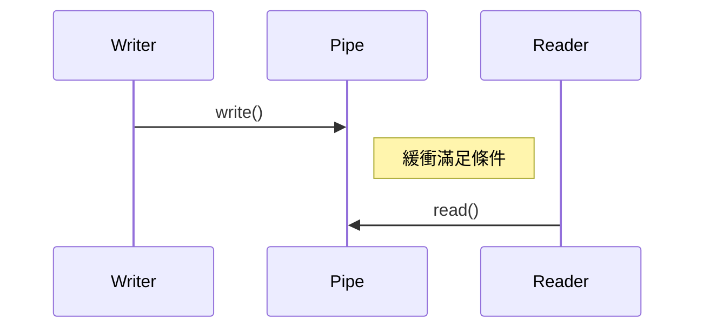
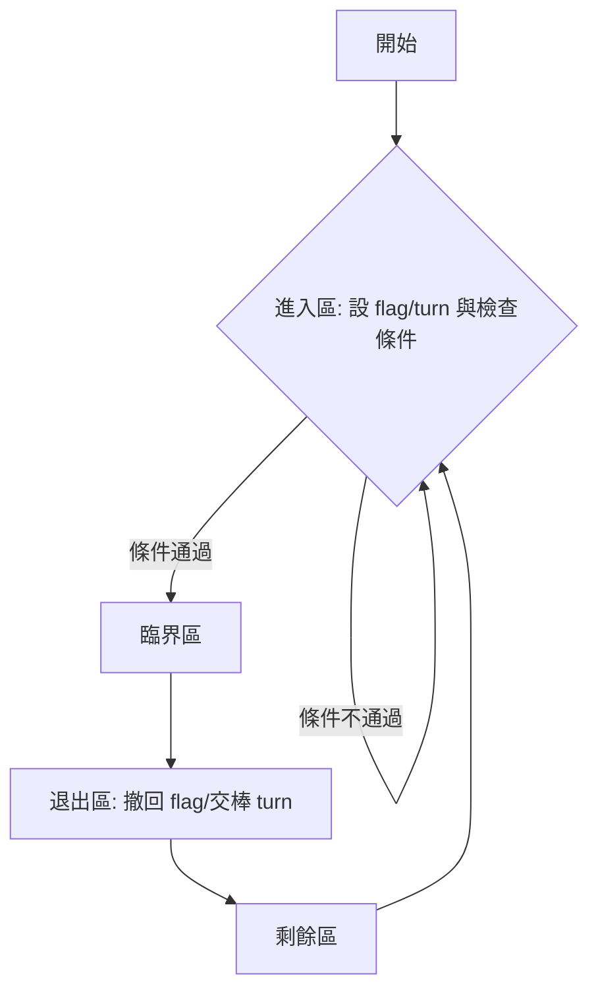
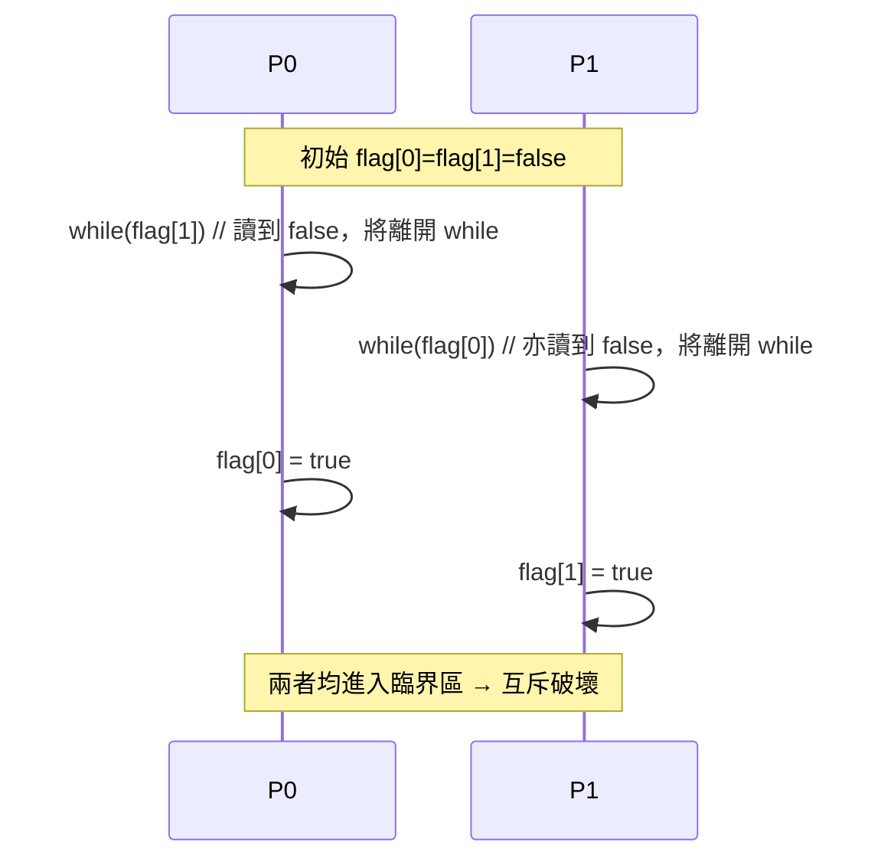

# 進程與線程

上次編輯時間: 2025年9月1日 下午5:19
建立時間: 2025年8月12日 下午1:37

# 線程與進程

---

## 線程(Thread)

---

1. **線程是處理器可調度的最小單位**
2. **多 CPU 系統中**，每個線程可佔用不同 CPU 執行
3. **每個線程都有自己的：**
    - 線程 ID
    - 線程控制塊（TCB）
4. **線程有三種基本狀態：**
    - 就緒
    - 阻塞
    - 執行
5. **線程幾乎不擁有系統資源**
6. **同一進程的所有線程共享該進程的資源**
7. **線程間通訊非常快速，甚至無需系統干預**
8. **同進程中線程的切換：**
    - 不會引起進程切換 → 系統開銷小
9. **不同進程間的線程切換：**
    - 會引起進程切換 → 系統開銷大

---

**二、線程的實現方式**

1. **使用者級線程（User-Level Thread, ULT）**
    - 由應用層程式庫管理，不需要內核支援
2. **內核級線程（Kernel-Level Thread, KLT）**
    - 由操作系統核心直接支援與管理
3. **混合方式（Combined Model）**
    - 使用者與內核共同參與管理

---

 三、多線程模型（綁定關係）

**1️⃣ 一對一模型（1:1）**

- 每個使用者級線程對應一個內核線程
- ✅ 優點：多核可並行執行，效能高
- ❌ 缺點：建立多線程需系統支援，開銷大

---

**2️⃣ 多對一模型（n:1）**

- 多個使用者級線程對應一個內核線程
- ✅ 優點：管理簡單，系統無需介入
- ❌ 缺點：一個線程阻塞，整個進程阻塞（並發性差）

---

**3️⃣ 多對多模型（n:m）**

- 多個使用者線程對應多個內核線程
- ✅ 優點：高彈性、可多核並行
- ❌ 缺點：實作複雜，需操作系統支援

---

## 進程(Process)

**1. 定義**

- 進程是**正在執行的程序**的實例，包含程式碼、資料、暫存器狀態等。
- 是作業系統進行**資源分配與調度**的基本單位。

---

**2. 進程的組成**

一個進程包含：

1. **程式碼段（Code Segment）**
2. **資料段（Data Segment）**
3. **堆（Heap）**（動態分配記憶體）
4. **棧（Stack）**（函數調用與局部變數）
5. **程式計數器（PC）**、暫存器內容
6. **進程控制塊（PCB, Process Control Block）**

---

3. **進程控制塊（PCB）**

- 主要內容：
    - 進程識別資訊（PID）
    - 處理器狀態（暫存器、程式計數器）
    - 調度資訊（優先級、排程狀態）
    - 記憶體管理資訊
    - I/O 狀態資訊

<aside>
💡

**Context Switching（上下文切換）**

---

**什麼是「上下文」**

- **上下文**＝某進程/線程當下的運行狀態：通用暫存器、**PC**、**SP**、程式狀態字、浮點暫存器、**地址空間/頁表**、核心棧指標、開啟的文件/訊號/排程資訊等。
- 這些資訊會被**保存到 PCB/TCB**，之後才能從同一點恢復執行。

**何時會發生切換**

- 時間片用完（可搶佔排程）
- 進程發生阻塞（等待 I/O、鎖、事件）
- 主動讓出（yield、睡眠）
- 有更高優先權就緒
- 中斷/系統呼叫返回時觸發排程

> 注意：切換發生時 CPU 通常不會 idle。CPU 會轉去執行內核態的排程與切換程式；只有「就緒佇列為空」時，才會進入 idle thread。
> 

---

**正確的切換流程（含原子性）**

1. **觸發點**：中斷/陷入/排程點到來。
2. **保存 P0**：把 P0 的暫存器、PC、SP… **存入 P0 的 PCB**。
3. **原子更新 P0 狀態與佇列**（關鍵！）
4. **選擇 P1**：排程器從就緒佇列挑出下一個要跑的進程/線程 P1。
5. **載入 P1**：
    - 切換到 P1 的**地址空間/頁表**與**核心棧**，
    - 從 **P1 的 PCB** 取回暫存器、PC、SP。
6. **返回執行**：從內核返回（或中斷返回）到 P1，繼續在用戶態/內核態執行。

**內核如何保證「原子性」**

- **關閉本地中斷**（critical section 期間避免被中斷打斷）
- **禁搶佔**或使用**自旋鎖/互斥**保護就緒佇列、阻塞佇列等核心資料結構
- 某些平台還會以**一次性寫入/更新**指標與狀態，確保「要嘛全做完、要嘛全不做」

**上下文切換的開銷（為何叫「浪費」）**

- **時間開銷**：保存/恢復暫存器、切換核心棧與頁表、跑一趟排程器。
- **快取相關**：新任務的工作集不同 → **L1/L2 Cache、TLB** 命中率下降，**分支預測/流水線**也可能被沖掉。
- **間接效應**：頻繁切換使有效 CPU 時間被管理開銷吃掉（system overhead）。

**降低開銷的小技巧**

- 合理設定**時間片**與**優先權**、減少不必要的搶佔
- 提升**CPU 親和性**（讓同一任務盡量在同一核心上跑）
- 降低鎖競爭與阻塞（用非阻塞 I/O、減少長臨界區）
- I/O 密集場景用**異步模型**或更粗粒度的排程

---

> 上下文切換是「**保存 P0 → 原子地調整狀態+佇列 → 載入 P1**」的內核動作；中間的狀態轉換和佇列連結**必須原子完成**，不然系統內部資料就會「一半新、一半舊」，導致災難性的管理錯誤。
> 
</aside>

---

**4.進程狀態（Process States）**


常見的五狀態模型：

1. **`新建（New）`**：進程正在被建立
    - **步驟**
        1. 分配唯一 PID
        2. 分配記憶體與資源（程式碼段、資料段、堆、棧、檔案描述符等）
        3. 建立並初始化 **PCB**（進程控制塊）
        4. 設定初始上下文（寄存器、PC 等）
        5. 插入**就緒隊列**等待 CPU
    - **父子關係**
        - **繼承**：子進程會繼承父進程部分資源（開啟的檔案、工作目錄、環境變量等）。
        - **系統呼叫**：
            - Linux/Unix：`fork()`（複製父進程，返回兩次）
            - Windows：`CreateProcess()`（同時創建進程與主線程）
2. **`就緒（Ready）`**：等待 CPU 執行
    - **主動結束**：進程自行執行 `exit()`
    - **被動結束**：父進程或 OS 發送信號強制結束
    - **父親拿回孩子的資源**（釋放資源）：
        - 進程終止後，其 PCB 與分配的記憶體、打開的檔案等會被釋放
        - 父進程需呼叫 `wait()` 或 `waitpid()` 回收子進程資源（否則形成 **殭屍進程 Zombie**）
            
            <aside>
            💡
            
            **zombie(殭屍) & orphan(孤兒)**
            
            **zombie:父還在執行，子已終止。**
            
            **orphan:父還在已終止，子還在執行。**
            
            </aside>
            
3. **`執行（Running）`**：正在 CPU 上執行
    - 當進程**無法繼續執行**（如等待 I/O、等待鎖、等待事件），會進入阻塞狀態
    - OS 將進程從 CPU 上移除，放入**阻塞隊列**
    - 阻塞是**主動行為**（進程自願等待）
4. **`阻塞（Waiting/Blocked）`**：等待 I/O 或其他事件
    - 當阻塞條件滿足（I/O 完成、事件到來、資源可用）
    - OS 將該進程的 PCB 狀態改為 **就緒**，並移入**就緒隊列**
    - 等待 CPU 排程重新執行
5. **`終止（Terminated）`**：執行結束

---

### 信號（Signal）

 **一、信號的作用**

- **信號是一種異步處理機制**，常用於：
    - 通知進程某個特定事件已經發生（例如：中斷、非法存取、Ctrl+C）
    - 實現進程間簡單通訊（IPC）
- 信號可以由：
    - 進程彼此之間傳送
    - 系統內核發送
    - 進程自己產生

---

 **二、信號的發送**

- 使用 `kill(pid, signo)` 系統呼叫向目標進程發送信號
- `pid`：接收信號的進程 ID
- `signo`：要發送的信號編號

---

 **三、信號的保存**

- 每個進程的 PCB 中有：
    - `pending` 欄位：待處理的信號（1 表示尚未處理）
    - `blocked` 欄位：被阻塞的信號（1 表示暫時禁止處理）
- 使用 **N 位元陣列** 來儲存所有信號狀態（1 bit 記錄 1 種信號）

---

 **四、信號的處理（重點）**

**⏰ 處理時機（When）**

- 當進程 **從核心態切換回用戶態時**（例如：
    - 系統呼叫返回
    - 中斷處理返回
- 系統會檢查是否有未處理的信號 → 若有，就**處理信號**

---

**⚙️ 如何處理（How）**

1. **執行系統的預設處理函式**
    - 每種信號皆對應預設行為（如終止、忽略）
    - 範例：Linux 的 `SIGWINCH` 預設為忽略
2. **執行使用者自訂處理函式**
    - 程式可透過 `signal()` 等函式註冊處理邏輯
    - 若有自訂邏輯，會覆蓋原本的預設處理方式

---

**🧩 補充特點**

- 不同作業系統對信號類型定義不完全相同
- 同一類信號若重複收到，會**合併儲存**（只記一次）
- 有些信號**不能被忽略或自訂處理**，如：
    - `SIGKILL`、`SIGSTOP`（永遠強制）

---

# **進程間通訊（IPC）**

**共享內存（Shared Memory）**

- **用途**：適合快速傳遞大量資料（影像處理、影片處理、資料庫快取）。
- **風險**：若未同步 → **Race Condition（競爭情況）**
    - 不同步時，執行順序不同會導致資料不一致。
- **解法**：同步機制保護臨界區（Critical Section, C.S.）。

---

**📮 訊息傳遞（Message Passing）**

1. **通信方式**

🔹 直接通信（Direct）

- **對稱**：發送方與接收方都需指定對方 ID
- **非對稱**：發送方指定接收方 ID；接收方可接收任意來源

🔹 間接通信（Indirect）

- 使用**訊息隊列 / 信箱（Mailbox）**作為中介
- 發送方將訊息送至中介，接收方從中介取出

---

2. **類型與實現**

**1) Socket**

- 基於 **IP + Port** 標識進程
- 支援 **TCP**（可靠，面向連線）與 **UDP**（不可靠，無連線）
- **全雙工**（雙向傳輸），可**跨網絡**
- 伺服器 `accept()` 後可開新執行緒處理多個請求
- **適用**：本地 IPC（Unix Domain Socket）與跨主機通信

---

**2) 管道（Pipes）**

- **匿名管道**：
    - 單向通信
    - 父子進程通信
    - 隨進程結束而消失
- **命名管道（FIFO）**：
    - 在檔案系統中有名稱
    - 可持久化
    - 適用於**不相關進程**
    - 若需雙向通信 → 建立兩條管道

---

**3) RPC（Remote Procedure Call）**

- **概念**：對使用者透明的跨網路函數呼叫
- **優點**：
    - 高透明性（像呼叫本地函數一樣）
    - 支援跨平臺
    - 內建錯誤處理機制
- **缺點**：
    - 有延遲（網路傳輸開銷）
    - 依賴統一接口定義
    - 需處理安全與驗證
- **應用場景**：
    - 微服務架構
    - 分散式資料庫
    - 遠端 API 呼叫

---

# **進程互斥**

**1. 核心概念（Executive Summary）**

- **異步性**：並發進程的執行順序**不可預知**。
- **同步（direct synchronization）**：為滿足**先後關係**而**協調進程次序**（例：**先寫後讀**）。
- **互斥（mutual exclusion / indirect constraint）**：對**臨界資源**一次只允許**一個**進程進入**臨界區**。
- 判斷互斥是否「好」要看四原則：**空閒讓進、忙則等待、有限等待、讓權等待**。

---

**2. 進程同步（為了先後）**

- 定義：兩個或多個進程**合作完成任務**，需**確定事件的先後關係**，消除異步帶來的不可預知性。
- 典型場景：管道/緩衝區「**寫在前、讀在後**」。



- 常用工具（後續章節）：**Semaphore(P/V)**、條件變數、Monitor、事件/信號量等（能表達「先做A再做B」）。

---

**3. 進程互斥（為了排他）**

- **臨界資源**：同一時段只允許一個進程使用（印表機、共享變數）。
- **程式四段式**（必考名詞對位）
    - **進入區**：檢查能否進入＋**上鎖**。
    - **臨界區（臨界段）**：真正訪問臨界資源的代碼。
    - **退出區**：**解鎖**，清除佔用標誌。
    - **剩餘區**：做其他工作。
- 判題陷阱：**臨界區≠進入/退出區**；「臨界段」=「臨界區」。

---

**4. 互斥機制的 四大原則**

1. **空閒讓進**：臨界區空時，申請者**應能立即進入**。
2. **忙則等待**：已有進程在臨界區，其他申請者**必須等待**。
3. **有限等待（Bounded Waiting）**：等待者在**有限次等待**後必被允許進入（無飢餓）。
4. **讓權等待**：不能進入時應**讓出 CPU**（阻塞/睡眠），**不要忙等**佔用處理器。
    - 純軟體自旋多**不滿足**本條；信號量/條件變數可滿足。

---

## **進程互斥的軟體方法**

**1) 考點速覽**

以共享變數實作互斥的四套經典協定：**單標誌法（Alternation）**、**雙標誌先檢查**、**雙標誌後檢查**、**Peterson 演算法**。以 `flag[i]`（**意願**）與 `turn`（**禮讓/優先權**）協調**進入區→臨界區→退出區**。逐一對照「**互斥、空閒讓進、忙則等待、有限等待、讓權等待**」五原則，是選擇題與簡答大題高頻考點。

---

**2) 四種演算法精要**

> 設兩進程 Pi 與 Pj（j = 1 - i）。方括號標註四段區塊。
> 

**3.1 單標誌法（Alternation，輪流制）**

**核心**：用 `turn` 指示**當次允許者**，退出區把機會讓給對方。

**程式框架（Pi）：**

```c
/* 進入區 */    while (turn != i) ;
/* 臨界區 */    // critical section
/* 退出區 */    turn = 1 - i;
/* 剩餘區 */    // remainder

```

**優缺點與原則**

- 互斥 ✔、忙則等待 ✔；**空閒讓進 ✘**（即使空閒，若 `turn` 在對方，我也進不去）、有限等待 △、讓權等待 ✘（自旋）。

**一句話記**：**保互斥但僵硬輪流，空閒也可能不讓進。**

---

**3.2 雙標誌先檢查（check→set）**

**核心**：先看對方要不要進，若不要，我再宣告要進。

**程式框架（Pi）：**

```c
/* 進入區 */    while (flag[j]) ;     // 先檢查
                 flag[i] = true;      // 後宣告
/* 臨界區 */    // ...
/* 退出區 */    flag[i] = false;
/* 剩餘區 */    // ...

```

**致命點（並發反例）**：兩邊**幾乎同時**看到 `flag[j]==false`，接著**同時**把自己設 `true` → **同時進入臨界區**。

**原則**：互斥 ✘、空閒讓進 ✔、忙則等待 ✘、有限等待 ✘、讓權等待 ✘。

**一句話記**：**「同看空」→同上鎖→同進入（互斥失敗）。**

---

**3.3 雙標誌後檢查（set→check）**

**核心**：我**先宣告**要進，再看對方是否也想進。

**程式框架（Pi）：**

```c
/* 進入區 */    flag[i] = true;       // 先宣告
                 while (flag[j]) ;    // 後檢查
/* 臨界區 */    // ...
/* 退出區 */    flag[i] = false;
/* 剩餘區 */    // ...

```

**致命點**：若兩邊都把自己設 `true`，**互相看到對方想進**而**無限自旋互等**（活鎖）。

**原則**：互斥 ✔、**空閒讓進 ✘**、**有限等待 ✘**、忙則等待 ✔、讓權等待 ✘。

**一句話記**：**「同時先上鎖」→互卡自旋（空閒亦不進、可能飢餓）。**

---

**3.4 Peterson 演算法（flag + turn）**

**核心**：同時使用**意願旗標** `flag[i]` 與**禮讓指示** `turn`。**最後一次**設置 `turn` 的那一方**喪失優先權**。

**程式框架（Pi）：**

```c
/* 進入區 */    flag[i] = true;            // 表達意願
                 turn = j;                  // 禮讓對方
                 while (flag[j] && turn == j) ; // 對方也想進且我最後禮讓 → 等
/* 臨界區 */    // ...
/* 退出區 */    flag[i] = false;           // 撤回意願
/* 剩餘區 */    // ...

```

**正確性直觀**：若雙方同想進，**最後誰把 `turn` 設為對方**，誰先讓；另一方先進，退出後撤回 `flag`，被讓的一方即進。

**原則**：互斥 ✔、空閒讓進 ✔、忙則等待 ✔、有限等待 ✔、**讓權等待 ✘**（仍自旋）。

**一句話記**：**「先表意，再禮讓；對方也想進且我最後禮讓→我等」**。

---

3) 互斥協定流程（通用）



---

**4) 並發反例（先檢查法為何失敗？）**



---

**5) 總結比較（背表得分）**

| 特性/原則 | 單標誌 | 先檢查 | 後檢查 | **Peterson** |
| --- | --- | --- | --- | --- |
| 互斥 | ✔ | **✘** | ✔ | **✔** |
| 空閒讓進 | **✘** | ✔ | **✘** | **✔** |
| 忙則等待 | ✔ | **✘** | ✔ | **✔** |
| 有限等待 | △ | **✘** | **✘** | **✔** |
| 讓權等待（不自旋） | ✘ | ✘ | ✘ | ✘ |
| 關鍵機制 | turn | 檢查→設 | 設→檢查 | flag+turn |
| 常見問題 | 空閒不進 | 同時進 | 互卡等 | 自旋耗核 |

---

**6) 考題提示與易錯點**

- **辨識四段區塊**：題目常把數行程式打散，請能標出**進入區/臨界區/退出區/剩餘區**。
- **理由要貼原則**：作答務必用「互斥/空閒讓進/忙則等待/有限等待/讓權等待」來判定對錯。
- **Peterson 的限制**：默認**順序一致記憶**與共享變數的可見性；考研題通常不深究記憶體屏障，但口頭可補一句「實務需記憶體屏障」。
- **讓權等待如何達成？**：靠 **Semaphore/Mutex/Monitor** + **阻塞/喚醒**（之後章節），或以**硬體原子指令**實作不可分割上鎖再配合睡眠。

---

## **進程互斥的硬體方法**

**1) 核心概念摘要**

三種**硬體級**互斥：**中斷屏蔽（關/開中斷）**、**Test-and-Set（TS/TSL）** 與 **Swap（交換/XCHG）**。關鍵在於把「**檢查 + 上鎖**」做成**原子操作**，避免軟體法（先/後檢查）中的競態或互等。三者皆能保證互斥，但都屬**忙等待**，不滿足**讓權等待**；其中**中斷屏蔽僅適用單處理機且需內核特權**，TS/Swap 可用於多處理機。

---

**2) 重點整理**

---

**2.2 中斷屏蔽（Interrupt Disable/Enable，CLI/STI）**

**原理**：在**進入臨界區前關中斷**，使當前 CPU 上的執行不可被中斷/剝奪；**退出時開中斷**。

**示意**

```c
disable_interrupts();   // 關中斷（特權指令）
/* critical section */
enable_interrupts();    // 開中斷

```

**優點**

- 簡單、低開銷；在單核上能完整避免被中斷引發的切換。

**缺點/限制**

- **僅對本 CPU 有效**：多處理機上其他 CPU 仍可並行進入 → 不保互斥。
- **特權指令**：**只允許內核使用**，不適用一般使用者進程。
- 仍為**忙等待**風格保護（若用作原語包裹），**不滿足讓權等待**；長時間關中斷影響系統即時性。

---

**2.3 Test-and-Set（TS / TSL）**

**硬體語意**：對共享變數 `lock` **原子地**：

1. 讀出舊值到 `old`；2) 將 `lock` 置為 `true`；3) 返回 `old`。

> 以總線鎖/快取一致性確保跨處理機原子性（理解層面知道即可）。
> 

**偽碼（語意）**

```c
bool TestAndSet(bool *lock) { // 原子
  bool old = *lock;
  *lock = true;
  return old;
}

```

**用法（自旋鎖）**

```c
while (TestAndSet(&lock)) ;   // 當 old==true → 他人持鎖 → 自旋
/* critical section */
lock = false;                 // 釋放

```

**性質與評估**

- **互斥 ✔**（檢查+上鎖一氣呵成）。
- **空閒讓進 ✔**、**忙則等待 ✔**。
- **有限等待**：可能**公平性不足**（長自旋可致飢餓，視排程/回退策略）。
- **讓權等待 ✘**：等待者在 **while** 中持續佔用 CPU（自旋）。

---

**2.4 Swap（交換 / XCHG）**

**硬體語意**：**原子地交換**暫存器/記憶體兩個布林值。

**偽碼（語意）**

```c
void Swap(bool *a, bool *b) { // 原子
  bool t = *a; *a = *b; *b = t;
}

```

**用法（自旋鎖一例）**

```c
bool key = true;
while (key) {                 // key==true 表示我尚未獲鎖
  Swap(&lock, &key);          // 原子：若 lock==false → 交換後 key=false → 取得鎖
}
/* critical section */
lock = false;                 // 釋放

```

**性質與評估**

- 與 Test-and-Set **邏輯等價**：同為**原子上鎖**，可用於多處理機。
- 優缺點同 TS：**互斥 ✔**、**讓權等待 ✘**（自旋）、公平性需額外機制。

---

**3) 總結比較表**

| 面向 / 方法 | 中斷屏蔽 (CLI/STI) | Test-and-Set (TS/TSL) | Swap (XCHG) |
| --- | --- | --- | --- |
| 互斥 | 單處理機 ✔，多處理機 ✘ | ✔（跨處理機原子） | ✔（跨處理機原子） |
| 空閒讓進 | ✔ | ✔ | ✔ |
| 忙則等待 | ✔ | ✔ | ✔ |
| 有限等待 | 依策略（可能壟斷中斷） | 可能飢餓（需回退/排隊） | 可能飢餓 |
| 讓權等待（不自旋） | ✘ | ✘ | ✘ |
| 可否用於使用者態 | ✘（特權） | ✔（需系統提供共享鎖位址） | ✔ |
| 多處理機支援 | ✘ | ✔ | ✔ |
| 代表開銷/影響 | 影響即時性與中斷延遲 | 總線/快取鎖開銷 + 自旋耗核 | 同左 |
| 常見用途 | 內核短臨界段 | 自旋鎖、底層鎖原語 | 自旋鎖變體 |

---

## 鎖（Lock）

**1) 核心概念摘要**

**鎖**是用來實現互斥的機制，可視為一個布林變數（`locked ∈ {true,false}`）。以 `acquire` 上鎖、`release` 解鎖。若 `acquire` 時鎖已被占用，**自旋鎖**讓執行緒在迴圈中忙等（busy-wait）直到可用：互斥簡潔高效，但**違反讓權等待**、可能浪費 CPU；在**多處理器且臨界區極短**時通常反而效率高。

---

**2) 名詞與模型**

- **Lock（互斥鎖）**：抽象為一個共享狀態 `locked`。
    - `acquire(L)`: 嘗試把 `locked` 由 `false→true`。
    - `release(L)`: 把 `locked` 設回 `false`。
- **自旋鎖（spin lock）**：`acquire` 無法立即成功時，**不睡眠**，而是在 CPU 上**重複測試**鎖狀態（忙等）。
- **忙等 vs. 讓權等待**
    - 忙等：佔用 CPU 反覆檢查條件（違反**讓權等待**）。
    - 讓權等待：無法前進時阻塞自己，把 CPU 還給系統（如 mutex/semaphore）。

---

**3) 典型實作（以硬體原子指令保證「檢查+上鎖」不可分割）**

> 任一種原子指令都可用來做自旋鎖：Test-and-Set/TSL、Swap/XCHG 等。
> 

**（A）Test-and-Set 版**

```c
// 原子：返回舊值，並把 *L 設為 true
bool TestAndSet(volatile bool *L);

void acquire(volatile bool *L) {
  while (TestAndSet(L)) { /* spin */ }
}
void release(volatile bool *L) { *L = false; }

```

**（B）Swap 版**

```c
// 原子：交換暫存器 key 與 *L
void Swap(volatile bool *L, bool *key);

void acquire(volatile bool *L) {
  bool key = true;
  while (key) Swap(L, &key);   // 若 *L==false → 交換後 key=false → 取鎖
}
void release(volatile bool *L) { *L = false; }

```

---

**4) 性質與考點對照**

| 檢核原則 / 機制 | 自旋鎖（TSL/Swap 等） |
| --- | --- |
| **互斥** | ✔（原子化「檢查+上鎖」） |
| **空閒讓進** | ✔（鎖空時可立即取得） |
| **忙則等待** | ✔（鎖忙時等待） |
| **有限等待** | △（可能有飢餓，視排程/退避策略） |
| **讓權等待** | ✘（忙等佔用 CPU，不主動阻塞） |

> 小心陷阱：忙等 ≠ 永遠霸佔 CPU。時間片用完仍會被調度器換下；但在其時間片內確實消耗 CPU。
> 

---

5) 什麼時候用自旋鎖？

- **適合**：多處理器（SMP）+ **臨界區極短**（如更新簡短的核態共享變數/旗標）。
    - 例：P1 正持鎖在核心 A；P2 在核心 B 忙等。P1 很快釋放鎖 → P2 幾乎**無上下文切換成本**地立即獲鎖，整體延遲小。
- **不適合**：**單處理器**或**臨界區較長/可能堵塞**（I/O、睡眠、系統呼叫）。
    - 單處理器時，忙等者占住唯一 CPU，持鎖者只有等到排程切回才有機會解鎖 → 浪費。

> 經典準則：短臨界區用自旋，長臨界區用阻塞（mutex/semaphore/條件變數）；或採spin-then-sleep混合策略（先自旋 N 次，仍失敗則阻塞）。
> 

---

6) 與其他鎖型的關係

- **單標誌法、TSL、Swap** 本質上都是**自旋鎖**（忙等實作互斥）。
- 若題目問「如何同時滿足讓權等待？」→ 答：**改用阻塞式同步原語**（如 mutex/semaphore/monitor），或在自旋鎖上加入**退避（exponential backoff）/排隊化（ticket/MCS）/自旋後睡眠**。

---

**7) 易錯點 & 一句話記**

- **易錯點**
    - 以為自旋鎖「任何情況都高效」—錯；**僅當臨界區短且在 SMP** 才通常划算。
    - 忘了自旋鎖**不能在臨界區內做會阻塞的動作**（睡眠、I/O）。
    - 把忙等誤解為永不被換出—**時間片到仍會被換出**。
- **一句話記**
    
    > 鎖是布林，取鎖忙等；短而多核用，長則要睡眠。
    > 

---

## **信號量（Semaphore）**

**1) 核心概念摘要**

**信號量**是一種由作業系統提供、以**原語（不可中斷）執行的同步機制，用以解決互斥、同步與資源分配**。考研重點有兩類：**整型信號量**（純計數＋忙等）與**記錄型信號量**（計數＋等待佇列＋阻塞/喚醒）。前者雖能避免「先檢查後上鎖」的競態，但**違反讓權等待**；後者以 **block()/wakeup()** 實現**讓權等待**，是命題高頻核心。

---

**2) 定義與種類**

**2.1 基本觀念**

- **信號量 S**：抽象為能反映資源可用量的變數。
    - `S.value`：目前**可用資源數**（可為 0 或正整數；記錄型中可能暫時 < 0，絕對值代表等待者數目）。
- **原語**：P/V 操作在核心中**原子**完成，保證「檢查＋狀態更新」不可分割。

**2.2 兩類信號量**

| 類型 | 內涵 | 等待策略 | 是否滿足讓權等待 | 常見用途 |
| --- | --- | --- | --- | --- |
| **整型信號量** | 單一整數 `S` | **忙等**（自旋） | ✘ | 理論/教學、簡單模型 |
| **記錄型信號量** | 結構體：`value` + **等待佇列** | **阻塞/喚醒** | ✔ | 作業系統實務、考題主角 |

---

**3) P/V 原語（伪碼與要點）**

> 下列兩版僅示語意；實作於核心，整個 P/V 視為原子操作。
> 

**3.1 整型信號量（忙等版）**

```c
// 初始化：S = 資源數(如 1, 2, ...)
void P(volatile int *S) {          // wait
  while (*S <= 0) ;                // 忙等（違反讓權等待）
  (*S)--;                          // 取得一單位資源
}
void V(volatile int *S) {          // signal
  (*S)++;                          // 歸還一單位資源
}

```

**性質**：互斥/同步皆可；避免了「先檢查後上鎖被切換」的競態，但**等待者持續占用 CPU**。

**3.2 記錄型信號量（阻塞/喚醒版）**

```c
typedef struct {
  int value;                 // 可用資源數
  queue_t Q;                 // 等待佇列（通常 FIFO）
} semaphore;

void P(semaphore *S) {       // wait
  S->value--;                // 先佔位
  if (S->value < 0) {        // 無資源可用 → 需等待
    enqueue(&S->Q, current);
    block(current);          // 讓權等待：阻塞自己
  }
}

void V(semaphore *S) {       // signal
  S->value++;                // 歸還資源
  if (S->value <= 0) {       // 尚有人在等
    pcb_t *p = dequeue(&S->Q);
    wakeup(p);               // 喚醒一位等待者
  }
}

```

**關鍵**：

- `S->value < 0` 的絕對值 = **等待中的進程數**。
- **滿足讓權等待**：不可用時**阻塞**，不自旋。
- 佇列常採 **FIFO** 以助**有限等待/公平性**。

---

---

4) 常見考點 & 易錯提醒

- **題目默認**：未特別說明時，「某信號量 `S` 的 P/V」指**記錄型信號量**（會阻塞，不忙等）。
- **整型 vs 記錄型**核心差異：是否**讓權等待**、是否有**等待佇列**。
- **原子性**：P/V 必須視為不可分割；否則又會回到「先檢查後上鎖」的競態。
- **`S.value` 為負**：其絕對值 = **等待者數**（僅限記錄型的定義/解題慣例）。
- **公平性**：若未說明，預設採 **FIFO** 喚醒，利於**有限等待**。
- **勿在臨界區做阻塞性操作**（尤其使用整型/自旋鎖時）以免造成死鎖或長時間佔用。

---

**5) 一句話總結（背誦版）**

> 整型忙等不讓權；記錄型排隊能睡眠。P/V 原子保正確，value 正負看資源。
> 

---

### **用信號量實現互斥與同步**

**1) 為什麼用信號量？**

- 早先的軟硬體互斥法（單/雙標誌、TSL、SWAP…）**無法讓權等待**：資源不可用時會忙等自旋。
- **記錄型信號量**（Semaphore + 等待佇列）在 `P/V` 中內建 **阻塞/喚醒**，可滿足讓權等待，因而更「進階、通用」。

---

**2) 信號量直覺**

- 把**信號量值**視為某種「**資源剩餘數**」。
- `P(S)`：**申請一單位資源**。若資源不足→**阻塞(block)**。
- `V(S)`：**釋放/產生一單位資源**。如有人等待→**喚醒(wakeup)** 一個。

> 題目未特別說明時，S 默認為記錄型信號量（有佇列、會阻塞，不忙等）。
> 

---

**3) 互斥（critical section）**

- 為每個臨界資源設一把**互斥信號量** `mutex`，**初值 = 1**（一個「名額」）。

```c
P(mutex);          // 進臨界區前「先 P」
/* critical section */
V(mutex);          // 出臨界區後「再 V」

```

- 心法：**「名額」思維**——`mutex=1` 表示同時僅允許 1 個進程進入臨界區。
- 注意：
    1. **不同臨界資源用不同的 mutex**（例：印表機 vs 攝影機）。
    2. **P/V 成對**：漏 P → 無法互斥；漏 V → 等待者永不被喚醒。

---

**4) 同步（一前一後）**

- 目標：強制 **「前置動作」先於「後置動作」**。
- 套路：設**同步信號量** `S`，**初值 = 0**（起始無「通行憑證」）。
    - 在**前**操作**之後**執行 `V(S)`（發憑證）。
    - 在**後**操作**之前**執行 `P(S)`（收憑證，否則阻塞）。
- 口訣：**前 V 後 P**
    
    例：需「P1: code2 先，P2: code4 後」：
    

```c
// P1:
code1; code2;
V(S);              // 前V：完成前件後發放憑證

// P2:
P(S);              // 後P：先拿到憑證才可往下
code4;

```

---

---

**5) 常見考點 & 易錯**

1. **默認記錄型**：題目寫 `P(S)/V(S)` 未註明時，當作「阻塞式」信號量。
2. **互斥 vs 同步** 的口訣：
    - 互斥：**進臨界區前 P，出後 V**（**P 前 V 後**）。
    - 同步：**前件後 V，後件前 P**（**前 V 後 P**）。
3. **一資源一把鎖**；勿混用不同資源的 mutex。
4. **P/V 配對**與數量對齊：多一次 `V` 可能導致越序；少一次 `V` 造成永久阻塞。
5. 若涉及**公平性/有限等待**，等待佇列通常採 **FIFO**（除非題面另述）。

---

**6) 一句話總結（背誦版）**

> 互斥：P 前 V 後；同步：前 V 後 P；多邊同步按邊設零、前 V 後 P 套到底。
> 

---

### **生產者－消費者問題**

**問題要點**

- 一組生產者與一組消費者，共享**大小為 N 的有界緩衝區**（臨界資源）。
- **兩對同步**
    1. 只有**緩衝區非空**時，消費者才能取（有產品才能消費）。
    2. 只有**緩衝區未滿**時，生產者才能放（有空格才能生產）。
- **一個互斥**：對緩衝區的訪問必須互斥，避免覆寫等競態。

---

**信號量設定（記錄型，具阻塞/喚醒）**

- `mutex = 1`：互斥信號量，保護**對緩衝區的訪問**。
- `full = 0`：**已佔用槽位（產品數）**；初始緩衝區為空 → 0。
- `empty = N`：**空閒槽位數**；初始全空 → N。

> 直覺：P(x)= 申請/消耗一單位資源；V(x)= 釋放/產生一單位資源。
> 
> 
> 同步資源對應：消費者消耗 `full`；生產者消耗 `empty`。
> 

---

**正確程式骨架（口訣：前 V 後 P｜互斥在內層）**

```c
// Producer
while (true) {
    item = produce();          // 不在臨界區
    P(empty);                  // 同步：要有空格
    P(mutex);                  // 互斥：進入緩衝區
    put(item);                 // 臨界區，儘量短
    V(mutex);                  // 退出臨界區
    V(full);                   // 同步：產品 +1，喚醒消費者
}

// Consumer
while (true) {
    P(full);                   // 同步：要有產品
    P(mutex);                  // 互斥：進入緩衝區
    item = get();              // 臨界區，儘量短
    V(mutex);                  // 退出臨界區
    V(empty);                  // 同步：空格 +1，喚醒生產者
    consume(item);             // 不在臨界區
}

```

**為何 `P` 的順序必須如此？**

- **先同步再互斥**：`P(full/empty)` **在外**，`P(mutex)` **在內**。
- 若顛倒（先 `P(mutex)` 再 `P(empty)`/`P(full)`），在「滿/空」邊界情況下會出現：
    
    生產者持有 `mutex` 等 `empty`，同時消費者等 `mutex` 才能取走→**互相等待**⇒**死鎖**。
    
- 兩個 `V` 的順序可交換（`V` 不會阻塞）。

---

**臨界區設計原則**

- **臨界區越短越好**：`produce()`、`consume()` 放在**臨界區外**，降低鎖佔用時間，提高併發度。

---

**同步 vs 互斥：誰跟誰配對？**

- **互斥**：同一進程內的 `P(mutex)` … `V(mutex)` 成對，保護共享緩衝區操作。
- **同步**：跨進程的配合
    - 生產者的 `V(full)` ↔ 消費者的 `P(full)`
    - 消費者的 `V(empty)` ↔ 生產者的 `P(empty)`

---

**考點與易錯**

1. **初值**：`mutex=1, full=0, empty=N`（名額思維）。
2. **P 順序**：務必「**先同步 P，後互斥 P**」；反之易死鎖。
3. **兩對同步要分清**：消費者等 `full`，生產者等 `empty`。
4. **P/V 成對**：漏 `V` 會讓等待者永不被喚醒。
5. **臨界區短小**：只包「放/取」動作與必要索引更新。

---

**一句口訣（背誦版）**

> 互斥在內層、同步在外層；消費等滿、生產等空；前 V 後 P、死鎖不來擾。
> 

### 多生產者－多消費者

**建模（用「事件」而不是「單個進程」思考）**

- 事件1：**放蘋果** → 事件2：**吃蘋果**
- 事件3：**放橘子** → 事件4：**吃橘子**
- 事件5：**盤子變空** → 事件6：**放水果**（父或母都可能觸發）

**信號量設置（記錄型）**

- `apple = 0`：盤中蘋果數（初始無蘋果）
- `orange = 0`：盤中橘子數（初始無橘子）
- `plate = 1`：**空盤名額**（盤子容量=1 → 初始有 1 個空位）
- `mutex = 1`（可選）：保護對盤子的讀寫（容量=1時通常可省略；見下）

> 口訣：前V後P；同步 P 在外層，互斥 P(mutex) 在內層。
> 

**方案A：容量=1（可不加 mutex 的最簡解）**

> 由於 apple / orange / plate 三個計數在任一時刻最多只有一個>0，已自然形成互斥。
> 

```c
// Father: 放蘋果
while (true) {
    make_apple();
    P(plate);          // 先確保空盤
    put_apple();
    V(apple);          // 前V：宣佈「有蘋果」
}

// Mother: 放橘子
while (true) {
    make_orange();
    P(plate);          // 先確保空盤
    put_orange();
    V(orange);         // 前V：宣佈「有橘子」
}

// Daughter: 吃蘋果
while (true) {
    P(apple);          // 後P：等蘋果出現
    take_apple();
    V(plate);          // 盤子變空 → 喚醒可放水果的一方
    eat_apple();
}

// Son: 吃橘子
while (true) {
    P(orange);         // 後P：等橘子出現
    take_orange();
    V(plate);          // 盤子變空
    eat_orange();
}

```

- 為什麼可不加 `mutex`？
    
    任一時刻只有一條路徑能通過第一個 `P(...)`（`plate/apple/orange` 其一>0），因此對盤子的實際操作不會並發衝突。
    

---

**方案B：通用／保守寫法（或容量>1 時必需）**

> 容量>1：必加 mutex 來保護選格＋放/取的臨界區；並改用 empty=N 代表空格數。
> 

**信號量**

- `empty = N`，`apple = 0`，`orange = 0`，`mutex = 1`

**程式骨架**

```c
// Producer: 父
while (true) {
    make_apple();
    P(empty);          // 同步：要有空格
    P(mutex);          // 互斥：選一格並放入
    put_apple();
    V(mutex);
    V(apple);          // 同步：蘋果+1
}

// Producer: 母
while (true) {
    make_orange();
    P(empty);
    P(mutex);
    put_orange();
    V(mutex);
    V(orange);
}

// Consumer: 女
while (true) {
    P(apple);          // 同步：要有蘋果
    P(mutex);          // 互斥：選對應一格並取走
    take_apple();
    V(mutex);
    V(empty);          // 空格+1
    eat_apple();
}

// Consumer: 子
while (true) {
    P(orange);
    P(mutex);
    take_orange();
    V(mutex);
    V(empty);
    eat_orange();
}

```

---

**易錯點 & 小提示**

1. 容量=1 時**可能**不需 `mutex`，但**考場時間緊**不易全面論證 → **加上 `mutex` 一定不錯**（記得同步P在外、互斥P在內）。
2. 別把同步當「進程與進程」；要把它當「**事件與事件**」的先後。
3. 臨界區要**盡量短**：`make_* / eat_*` 放在臨界區外。
4. `P/V` 必須成對；漏 `V` 會讓對方永遠醒不來。

---

**一句話背誦**

> 空盤先P，放完對應V；要吃先P對應水果；取完V空盤；互斥在內層，同步在外層。
> 

### 读者—写者问题

## 规则回顾

- 可**多读并发**；写**单独**进行。
- 有人**写**时：其余读/写**都禁入**。
- 目标：既要让读者们并发，又要避免**写者饥饿**（或按需要实现公平/优先）。

---

## 信号量与变量

- `rw = 1`：控制对“文件”的互斥进入（写独占 & 第一个读者加锁 / 最后一个读者解锁）。
- `mutex = 1`：保护读者计数 `count` 的读改写（保证“一气呵成”）。
- `w = 1`（可选）：**闸门/转闸**，用来实现**公平（防饥饿）防止讀者一直讀**。
- `int count = 0`：当前正在读的读者数。

---

## 方案A：读者优先（简单，但可能饿死写者）

> 用 rw + mutex + count。只有第一个读者 P(rw)，最后一个读者 V(rw)。
> 

**Reader**

```c
while (true) {
    P(mutex);                //防止P1，P2都為第一讀者同時訪問時
    if (count == 0) P(rw);   // 第一个读者锁文件
    count++;
    V(mutex);

    read_file();             // 读

    P(mutex);
    count--;
    if (count == 0) V(rw);   // 最后一个读者解锁
    V(mutex);
}

```

**Writer**

```c
while (true) {
    P(rw);                   // 与读/写互斥
    write_file();
    V(rw);
}

```

- 问题：若读者源源不断到来，写者会长期卡在 `P(rw)` → **写者饥饿**。

---

## 方案B：**读写公平（无饥饿）**（推荐）

> 加一个闸门 w：先到先服务。任何要进入“读/写入口流程”的进程都先过闸门。
> 

**Reader（公平版）**

```c
while (true) {
    P(w);                    // 进闸门，防插队
    P(mutex);
    if (count == 0) P(rw);   // 若我是第一个读者，锁文件
    count++;
    V(mutex);
    V(w);                    // 让后继排在我之后

    read_file();

    P(mutex);
    count--;
    if (count == 0) V(rw);   // 若我是最后一个读者，解锁文件
    V(mutex);
}

```

**Writer（公平版）**

```c
while (true) {
    P(w);                    // 进闸门，占住入口
    P(rw);                   // 等待所有读者离开
    write_file();
    V(rw);
    V(w);                    // 放行入口
}

```

- 直觉：
    - **写者先到**→他占住 `w`，后到的读/写都在门外排队；写完再放行。
    - **读者先到**→读者能开读；此时写者到达会在 `P(rw)` 处等到**最后一个**读者离开。
    - 队伍按到达先后推进，避免两边饥饿 ⇒ **读写公平**。

---

## 顺序与易错点

- 对 `count` 的“判断+增减”必须用 `mutex` **包住**（检查与赋值一气呵成）。
- **先同步后互斥**的原则体现在：读者“是否需 `P(rw)`”的判断在 `mutex` 内完成；`rw` 只由“第一个/最后一个读者”操作。
- `V(...)` 的先后通常可交换；**`P` 的顺序不可乱**，尤其闸门 `w` 要在进入读/写路径**最前面**。
- 临界区越短越好：`read_file()/write_file()` 外面不再持有 `mutex`。

---

## 想要“写者优先”？

- 常见做法：再引入“有写者等待时先挡读者”的信号量（如 `readTry` + `rmutex/wmutex` 计数），到有写者等待就**阻止新读者进来**，先满足写者。思路与上面一致：用信号量把“检查→修改状态”的片段包成原子段。

---

## 一句话背诵

> 读者优先：第一个读者 P(rw)，最后一个读者 V(rw)，count 用 mutex 护。
公平法再加闸门 w：任何人先过门，先到先服务，无饥饿。
> 

### 哲学家进餐问题

## 核心模型

- 5 位哲学家围圆桌；筷子 5 根，**每根在相邻两人之间**（互斥资源）。
- 编号：哲学家/筷子均为 `0..4`
    - `left(i) = i`，`right(i) = (i+1)%5`
- 天真做法（先拿左再拿右）会出现：**人人各拿一根，互相等另一根 → 循环等待 → 死锁**。

---

## 基本信号量

```c
semaphore chopstick[5] = {1,1,1,1,1};   // 每根筷子一个互斥信号量

```

---

## 解法一：**限流法**（最多 4 人同时尝试进餐）

思路：用一个同步信号量，限制并发尝试拿筷子的人数为 4，保证至少有人能拿到两根。

```c
semaphore room = 4;

philosopher(i):
while (true) {
    think();

    P(room);                           // 进入“餐厅”
    P(chopstick[left(i)]);
    P(chopstick[right(i)]);
    eat();
    V(chopstick[right(i)]);
    V(chopstick[left(i)]);
    V(room);                           // 离开“餐厅”
}

```

- 破坏**循环等待**（总有一人能集齐两根），不会死锁；并发度尚可。

---

## 解法二：**奇偶序法**（不一致拿取顺序）

思路：奇数先左后右；偶数先右后左。毗邻的奇偶二人会先争同一根，**只会有一个成功，另一个直接阻塞在“第一根”之前**，避免“占一根再等另一根”。

```c
philosopher(i):
while (true) {
    think();

    if (i % 2) {                       // 奇数：先左后右
        P(chopstick[left(i)]);
        P(chopstick[right(i)]);
    } else {                            // 偶数：先右后左
        P(chopstick[right(i)]);
        P(chopstick[left(i)]);
    }
    eat();
    V(chopstick[left(i)]);              // 释放次序可对调
    V(chopstick[right(i)]);
}

```

- 同样打破**循环等待**；实现简单，吞吐好。

---

## 解法三：**拿筷子过程互斥**（原子化“拿两根”的尝试）

思路：给“拿筷子这段流程”加全局互斥，保证一次只允许**一个**哲学家执行“拿两根”的序列（可能降低并发，但不死锁）。

```c
semaphore mutex = 1;

philosopher(i):
while (true) {
    think();

    P(mutex);                           // 拿筷子流程互斥
    P(chopstick[left(i)]);
    P(chopstick[right(i)]);
    V(mutex);

    eat();

    V(chopstick[right(i)]);
    V(chopstick[left(i)]);
}

```

- 若在第二根上阻塞，会**连同 mutex 一起阻塞**，其他人无法启动“拿筷子流程”，等持有者吃完释放后继续，**避免循环等待**；但并发度最低。

---

## 易错点 & 速记

- `chopstick[k]` 是**互斥**信号量（初值 1）；两次 `P` 的**顺序不能随意**改（尤其在奇偶法里）。
- `V(...)` 的先后一般不影响正确性。
- 三种方案本质都是**打破“循环等待 / 占有并等待”**这一死锁条件。
- 考场通用小抄：
    - **限流法**：加 `room = N-1`。
    - **不一致顺序**：奇偶/编号有序（先取编号小的一根）都可。
    - **原子化拿取**：全局 `mutex` 包住“两次 P(chopstick)`”。

### 管程（Monitor）

## 为什么引入管程

- 用信号量（PV）写同步代码**易错**：顺序/加解锁位置稍有不慎就死锁或遗漏。
- 管程把“互斥+同步”的细节**封装**到抽象里（像“类”）：程序员只调接口，不直接操作 PV。

## 组成（会考）

1. **共享数据结构**（被并发实体共享的资源，如缓冲区）
2. **过程/入口函数**（只允许通过这些过程访问共享数据）
3. **初始化语句**（给共享数据设初值）
4. **名字**（管程标识）

## 基本特征（高频考点）

- **封闭性**：局部于管程的共享数据**只能**被管程内部的过程访问；外部必须**通过入口过程**进入。
- **互斥性**：任一时刻**仅允许一个**进程/线程在管程内执行某个内部过程（互斥由编译器/语言运行时保证）。
- **条件同步**：管程内配**条件变量** `cond`，并有
    - `cond.wait()`：调用者**释放管程**（退出临界区）并在该条件队列睡眠；
    - `cond.signal()`：唤醒**一个**在该条件上等待的进程/线程（若无等待者，信号不累积）。

> 直观记忆：只能走门（入口），一次只放一人（互斥），有人等就排队（条件变量）。
> 

---

## 用管程解：生产者–消费者（伪代码：Mesa 语义，推荐 `while`）

```c
monitor BoundedBuffer {
    item buf[N];
    int head = 0, tail = 0, count = 0;   // 共享数据
    condition notFull, notEmpty;         // 条件变量

    procedure insert(item x) {
        while (count == N) notFull.wait();   // 满则等待
        buf[tail] = x;  tail = (tail + 1) % N;  count++;
        notEmpty.signal();                    // 通知消费者
    }

    procedure remove(item &x) {
        while (count == 0) notEmpty.wait();   // 空则等待
        x = buf[head];  head = (head + 1) % N;  count--;
        notFull.signal();                     // 通知生产者
    }

    init { /* 可选：初始化已在定义处完成 */ }
}

```

**要点**

- **互斥天然成立**：进入 `insert/remove` 就已独占管程。
- 用 `while` 而非 `if`：被唤醒后需**重新检查条件**（Mesa 语义下可能被抢占）。
- `wait()` 前自动释放管程，避免把门“占着等”。

---

## 与信号量对比（速表）

- **互斥保障**：
    - 信号量：程序员手动 `P(mutex)/V(mutex)`；
    - 管程：编译器/运行时自动做。
- **同步表达**：
    - 信号量：用计数+队列，语义分散；
    - 管程：**条件变量**直表达“何时等/何时唤醒”。
- **易错点**：
    - 信号量：顺序、遗漏、双重解锁；
    - 管程：主要是**条件判断用 if/while**、**唤醒时机**。

---

## Java 与管程的类比（会用就行）

```java
class MonitorBuffer<T> {
    private final Queue<T> q = new ArrayDeque<>();
    private final int N;

    public MonitorBuffer(int n) { this.N = n; }

    public synchronized void insert(T x) throws InterruptedException {
        while (q.size() == N) wait();   // wait() 释放 this 的锁
        q.add(x);
        notifyAll();                    // 有货了，唤醒消费者
    }

    public synchronized T remove() throws InterruptedException {
        while (q.isEmpty()) wait();     // 空则等待
        T x = q.remove();
        notifyAll();                    // 空间可用，唤醒生产者
        return x;
    }
}

```

- `synchronized` ≈ 进入管程入口；`wait()/notify/notifyAll` ≈ 条件变量的 `wait/signal`（对象内置的条件队列）。
- `wait()` 必须在持有对象锁时调用；调用后**释放锁并阻塞**；被唤醒后需重新获得锁。

---

## 考点速背

- **两条铁律**：①只能经入口过程访问共享数据；②一次仅一人在管程内执行。
- **条件变量**用于同步；`wait` 释放管程、进入等待队列；`signal` 唤醒一个，不累计。
- 管程体现**封装**：把排队/阻塞/互斥隐藏在实现里，外部只用“调用函数”。

## 死锁（Deadlock）

## 一句话定义

并发环境下，多个进程/线程**因竞争不可剥夺资源**而**互相等待**对方持有的资源，导致相关进程**全部阻塞、无法推进**。

## 易混概念对比

- **死锁**：≥2 个进程，彼此等待对方资源；都在**阻塞态**。
- **饥饿**：进程**长期得不到**所需资源（调度/分配策略不公）；可能在**阻塞或就绪态**；可只涉及**1 个**进程。
- **死循环**：程序逻辑错误或有意设计导致一直循环；进程可在**运行态**（占 CPU）。

> 记忆：死锁=互等资源；饥饿=一直等不到；死循环=自己转圈。
> 

## 死锁的四个**必要条件**

1. **互斥**：资源一次只能被一个占用。
2. **不可剥夺**：已分配资源用完前不能被强抢，只能主动释放。
3. **请求并保持**：保持已占资源，同时再请求新资源。
4. **循环等待**：存在进程—资源**环形等待链**。

> 断其一则不可能死锁。
> 
> 
> **循环等待**：死锁一定有循环等待；但有循环等待**未必**死锁（若该类资源存在**可替代实例**）。当系统**每类资源只有一个实例**时，循环等待 ⇔ 死锁。
> 

## 何时容易死锁（典型场景）

- 竞争**不可剥夺**资源（如互斥锁、筷子、独占设备）。
- **推进顺序非法**：P1 抢到 R1 再要 R2，P2 抢到 R2 再要 R1。
- **信号量使用不当**：先对 `mutex` 做 P，再对“同步量”做 P，导致相互等待。

## 处理策略（总纲）

1. **预防**：**破坏四条件之一**（如资源有序分配破坏循环等待；允许抢占破坏不可剥夺；一次性申请破坏请求并保持；把共享做成可并发使用破坏互斥）。
2. **避免**：运行时用算法**避免进入不安全状态**（如**银行家算法**）。
3. **检测与解除**：允许死锁发生，周期检测（资源分配图/算法），一旦发现**回滚/剥夺/杀死**部分进程。

## 考点与陷阱

- 选择题高频：
    - “**循环等待必有死锁**”→ **错**。
    - “死锁是否可能只有一个进程？”→ **不可能**。
    - 死锁与饥饿、死循环的**状态区别**（阻塞/就绪/运行）。
- 语义题：把**信号量**也看作“资源”。
- 编程题：PV 顺序错误易致死锁；进入临界区前后对称释放。

## 小抄版判断题（自测）

- 存在互斥 + 请求并保持 + 不可剥夺，但无循环等待 ⇒ **不会**死锁。
- 每类资源仅 1 实例，出现循环等待 ⇒ **一定**死锁。
- 死循环进程能否占 CPU？⇒ **能**。
- 饥饿是否必须多个进程共同参与？⇒ **不必须**。

## 预防死锁

## 核心思路

**预防死锁 = 主动破坏“死锁四必要条件”中的至少一个：**

互斥 / 不可剥夺 / 请求并保持 / 循环等待。

---

## 四条件怎么“破”

### 1) 互斥（Mutual Exclusion）

- **做法**：把独占资源“改造成”可共享。典型是 **SPOOLing 假脱机**（讲义里误作 *spring/ring*）：先把打印请求写入假脱机文件/队列，由“输出进程”顺序送到打印机。
- **优点**：对外看是“共享”，天然不触发互斥争用。
- **缺点**：很多硬件**无法**共享；安全/一致性场景必须保留互斥 → 适用面有限。

### 2) 不可剥夺（No Preemption）

- **做法A**：进程请求新资源失败 ⇒ **立刻释放**已占全部资源，稍后**重试**。
- **做法B**：按**优先级**等策略对某些资源**强制剥夺**（适合易保存/恢复状态的资源，如 CPU、页框）。
- **缺点**：实现复杂、保存/恢复开销大；可能引入**饥饿**；系统吞吐下降。

### 3) 请求并保持（Hold and Wait）

- **做法**：**静态一次性分配**——运行前一次申请**全部**所需资源；得不到就不启动。
- **优点**：简单、直接消除“边持有边再要”的局面。
- **缺点**：资源长期闲置、利用率低；多资源进程可能**饿死**（被只要单资源的进程源源不断占走）。

### 4) 循环等待（Circular Wait）

- **做法**：**资源有序分配**——给资源全局编号，**按号递增**申请；同类资源**一次申请完**。
- **原理**：只能“小号等大号”，不会“绕回去要小号”→ 断开环。
- **缺点**：编号维护麻烦；与**实际使用顺序不一致**会造成长时间空闲；对程序员不友好（跨系统编号不同还得改代码）。

---

## 与“哲学家进餐”三种方案的**条件对应**

- **最多只允许 4 人同时进餐**：从并发度上**阻断环**，本质上**破坏循环等待**。
- **奇偶哲学家拿筷顺序相反**（一边先左，一边先右）：形成一种**有序获取**，**破坏循环等待**。
- **“拿筷子”动作加全局 mutex 串行化**：同一时刻只有**一个**人在申请资源，无法形成多进程的等待环 → **破坏循环等待**。
    
    > 注意：这并不消除“请求并保持”（有人可能先拿到一只再等另一只），但因申请被串行化，环路条件消失，故不死锁。
    > 

---

## 考点速览（易错提醒）

- **SPOOLing** 才是“假脱机”术语；不是 *spring/ring*。
- “循环等待 ⇒ 一定死锁？”仅在“**每类资源仅一个实例**”时成立；一般情形**未必**。
- 预防策略常见副作用：**资源浪费 / 吞吐下降 / 饥饿 / 实现复杂度上升**。

---

## 选择题用的小表

| 被破坏条件 | 常见实现 | 一句话副作用 |
| --- | --- | --- |
| 互斥 | SPOOLing 假脱机 | 适用面窄，非所有设备可共享 |
| 不可剥夺 | 失败即释放重试；按优先级剥夺 | 上下文保存成本、可能饥饿 |
| 请求并保持 | 运行前一次性分配 | 资源长期闲置，吞吐降 |
| 循环等待 | 资源全局编号、递增申请 | 编号维护难，编程不便 |

## 避免死鎖

银行家算法

## 核心概念

- **安全序列（Safe Sequence）**：按此顺序依次为进程分配所需资源，所有进程都能顺利完成并归还资源。存在安全序列 ⇒ **系统处于安全状态**。
- **安全状态 / 不安全状态**
    - **安全**：至少存在一个安全序列 ⇒ **一定不会死锁**。
    - **不安全**：当前看不到任何安全序列 ⇒ **可能**死锁（不等于已死锁）。
    - 关系：**死锁 ⇒ 不安全**；**不安全 ⇏ 必死锁**；**安全 ⇏ 不死锁**。
- 矩阵/向量（m 类资源、n 个进程）
    - `Max[n][m]`：各进程对各资源的**最大需求**
    - `Allocation[n][m]`：**已分配**
    - `Need[n][m] = Max - Allocation`：**尚需**
    - `Available[m]`：**可用**资源
    - 进程 i 的一次申请：`Request[i][m]`

## 安全性算法（判断当前是否安全）

1. `Work = Available`；`Finish[i]=false`（尚未满足）。
2. 找到某个 `i`：`Finish[i]=false` 且 `Need[i] ≤ Work`（**逐元素比较**）。
3. 认为 `Pi` 能完成：`Work += Allocation[i]`；`Finish[i]=true`；把 `Pi` 加入安全序列。
4. 重复 2–3，若所有 `Finish` 皆为 `true` ⇒ **安全**（得到一个安全序列）；否则 **不安全**。

> 口决：找得起（Need ≤ Work）→ 放得回（Work += Allocation）→ 全部过（Finish 全 true）就安全。
> 

## 银行家算法（避免死锁的资源请求判定）

对 `Pi` 的 `Request`：

1. **超需检查**：若 `Request > Need[i]` ⇒ **非法**（超出声明最大值）。
2. **资源够否**：若 `Request > Available` ⇒ **等待**（暂时不够）。
3. **试探分配**（关键的“先试后判”）：
    - `Available -= Request`
    - `Allocation[i] += Request`
    - `Need[i] -= Request`
    - 运行**安全性算法**：
        - 若 **安全** ⇒ **真正分配**（试探变正式）。
        - 若 **不安全** ⇒ **回滚**上述三步并让 `Pi` 等待。

## 考题速算技巧

- **向量比较逐元素**：`[a,b,c] ≤ [x,y,z]` 当且仅当 `a≤x ∧ b≤y ∧ c≤z`。
- **快速找序列**：一轮里可**同时挑多个**满足 `Need ≤ Work` 的进程，统一把它们的 `Allocation` 累加到 `Work`，再进下一轮（更快凑出安全序列）。
- **Available 计算**：若没直接给，可用总量减去各行 `Allocation` 之和。
- **归还语义**：某进程“完成”后，`Work += Allocation[i]`（相当于释放资源）。
- **安全序列不唯一**：找到任一条即可判安全。
- **易错点**：忘记回滚；把“不安全”当“已死锁”；把标量比较错当向量比较。

## 直观理解（BAT 贷款类比）


- **安全**：能排出如 `T→B→A` 或 `A→T→B` 的顺序，银行始终能周转满足最大承诺。
- **不安全**：当前排不出任何顺序；若后续再来一波大请求，可能把银行**卡死**（死锁）。

## 小结

- 银行家算法的**核心**是：**先试探、再验安全、再决定是否真正分配**。
- 记住三板斧：**不超需**、**够可用**、**试分配+安全性检查**。
- 概念关系要清：**安全 ⇒ 不死锁**；**死锁 ⇒ 不安全**；**不安全 ≠ 必死锁**。

## 檢測解除死鎖

## 1) 资源分配图（RAG）的要点

- **两类结点**
    - 进程结点：`P0, P1, …`
    - 资源结点：`R0, R1, …`（**一类资源**一个矩形，矩形内小圆点 = 该类资源的实例数）
- **两类边**
    - **请求边**：`P → R`（进程正在请求该类资源的一个实例）
    - **分配边**：`R → P`（该类资源的一个实例已分配给该进程）
    
    
    
- **图含义细节**：每一条边代表**一个资源实例**的请求/分配。

## 2) 死锁检测（图简化法）

> 一句话概括：反复消除与“不阻塞”进程相连的所有边，直到无边可消。
> 
- **不阻塞进程**：其当前请求的资源数 **≤ 系统可用实例数**（能被满足就不应阻塞）。
- **步骤**
    1. 找到一个“不阻塞且非孤立”的进程 `Pi`。
    2. 假想让 `Pi` 运行完成：**删去与 `Pi` 相连的所有边**（等价于释放它占有的资源）。
    3. 资源数随之增加，继续 1–2，直到：
        - **所有边都能删光** → 图**可完全简化** → **无死锁**（等价于存在一个安全序列）。
        - **仍有边残留** → 图**不可完全简化** → **发生死锁**；残留连边的进程即为**死锁进程**。
- **直观联系**：这一过程本质上就是在**构造安全序列**；能构造出来 ⇒ 系统处于**安全状态**。

## 3) 死锁判定与必要条件

- **死锁定理（图论表述）**：资源分配图**不可完全简化** ⇔ **系统发生死锁**。
- **四个必要条件**（回顾）：**互斥、请求并保持、不可剥夺、循环等待**。检测到死锁时，通常这些条件均成立。

## 4) 死锁解除（Recovery）策略

- **资源剥夺法（抢占）**
    - 暂停/挂起部分**死锁进程**，**回收**其已占资源，转分配给其他进程。
    - 注意防止被剥夺进程**长期饥饿**（可配合优先级或年龄提升）。
- **撤销（终止）进程法**
    - 强制终止部分或全部**死锁进程**并回收资源。
    - 简单有效，但**代价大**（已做工作全部丢失，可能接近完成却被杀）。
- **进程回退法（Rollback）**
    - 让一个或多个死锁进程回到某个**还原点**（检查点），撤销部分执行，释放资源以破局。
    - 需要系统**记录执行历史/设置检查点**，实现复杂。

### 选择“牺牲品”（Victim）常用准则

- **优先级**：优先“动”低优先级的进程。
- **已运行时间 / 已完成比例**：尽量不要牺牲已运行很久、快完成的。
- **预计剩余时间**：优先保证“马上能跑完”的进程继续完成。
- **占有资源多寡**：优先撤销/剥夺**占有资源多**的进程，见效快。
- **类型**：**交互式**进程尽量保留，优先牺牲**批处理**进程。
- **饥饿风险控制**：对被多次牺牲的进程提升优先级或限制剥夺次数。

## 5) 与“预防/避免”的关系（定位记忆）

- **预防/避免**：**不让**死锁发生（破坏必要条件 / 银行家算法确保安全）。
- **检测/解除**：**允许发生**但能**检测出来并清除**。

## 6) 考试小贴士

- 能**画/读懂**资源分配图：矩形（资源类）+小圆（实例数）+两类箭头。
- 会用“**图简化**”快速判断：找可满足的进程 → 删边 → 继续。
- 结论记忆：
    - **可完全简化 ⇒ 无死锁**；**不可完全简化 ⇒ 有死锁**。
    - **残留连边的进程 = 死锁进程**。
- 解除策略只需**理解思路与权衡点**，常作为选择题考核。